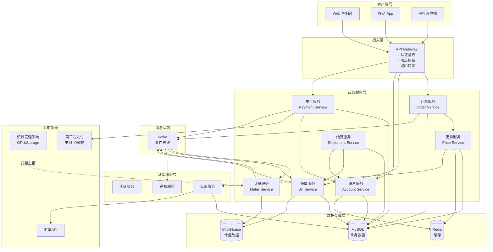
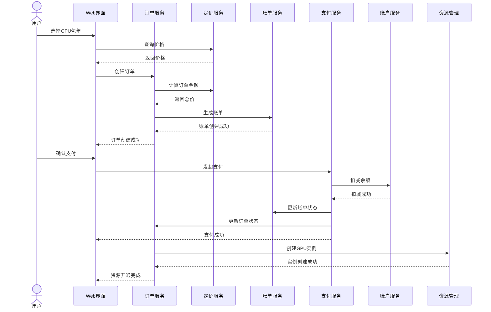
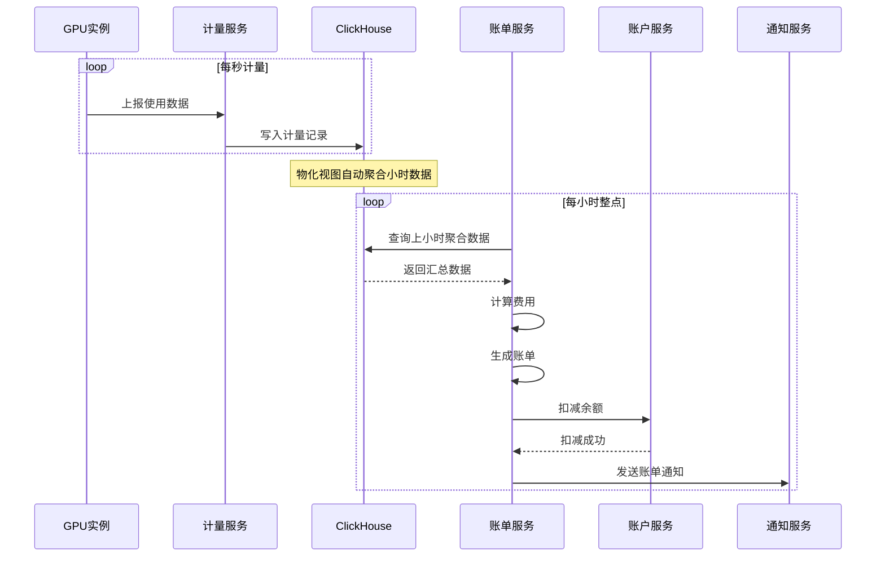
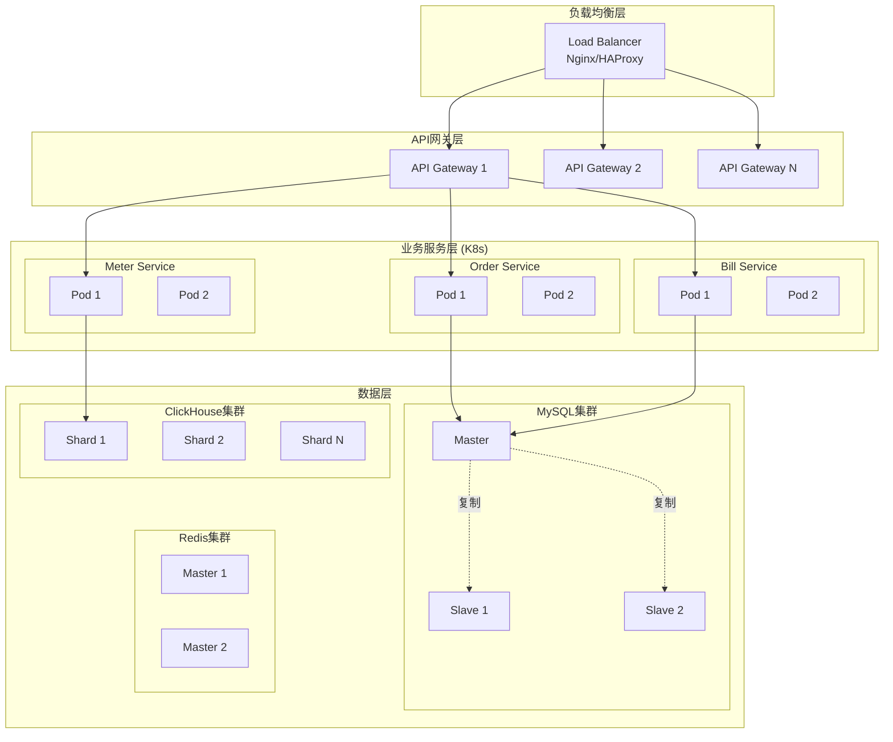
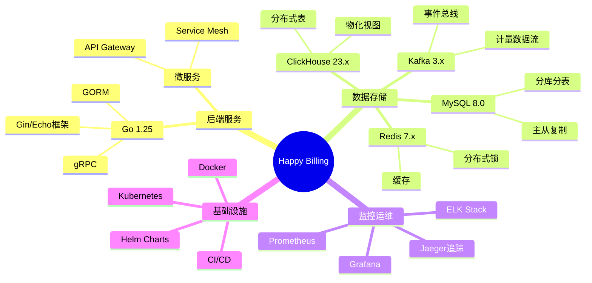
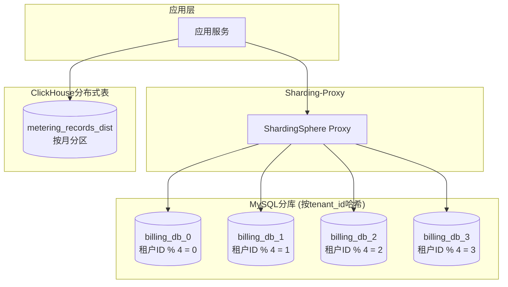

# 系统架构图

**文档版本**: v1.0  
**设计日期**: 2026-01-17

---

## 1. 整体系统架构图



---

## 2. 核心业务流程图

### 预付费下单流程



### 后付费计量出账流程



---

## 3. 数据流转架构


---

## 4. 部署架构图



---

## 5. 技术栈组件图



---

## 6. 数据库分库分表策略



---

## 7. 高可用设计

### MySQL高可用

```
MySQL Master (写)
    ↓ 异步复制
MySQL Slave 1 (读)
MySQL Slave 2 (读)
    ↓ 主库故障
自动切换 (MHA/MGR)
    ↓
Slave 1 提升为 Master
```

### ClickHouse高可用

```
Shard 1: Replica 1, Replica 2
Shard 2: Replica 1, Replica 2
Shard 3: Replica 1, Replica 2

ZooKeeper集群协调
```

### Redis高可用

```
Sentinel模式:
  Master (写)
  Slave 1 (读)
  Slave 2 (读)
  Sentinel监控自动故障转移
```

---

## 相关文档

- [系统架构](./01-architecture.md)
- [账单模型](./06-billing-models.md)
