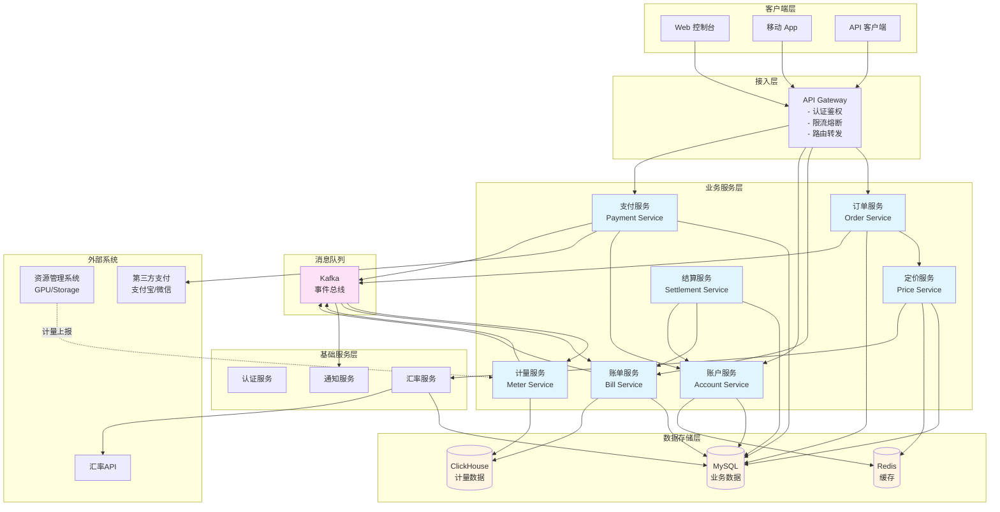
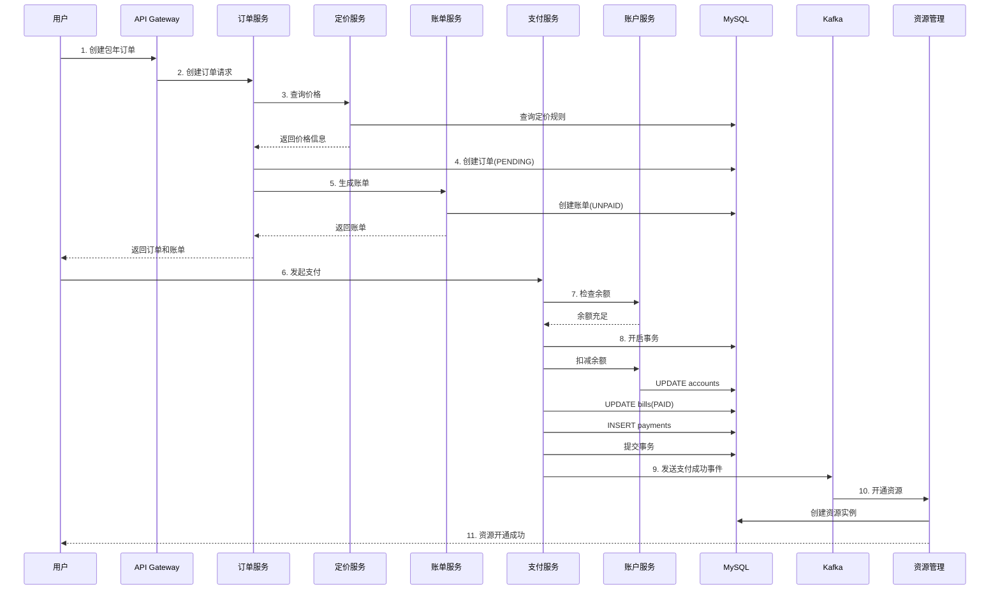
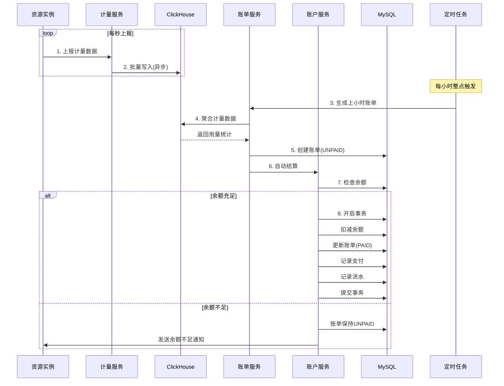
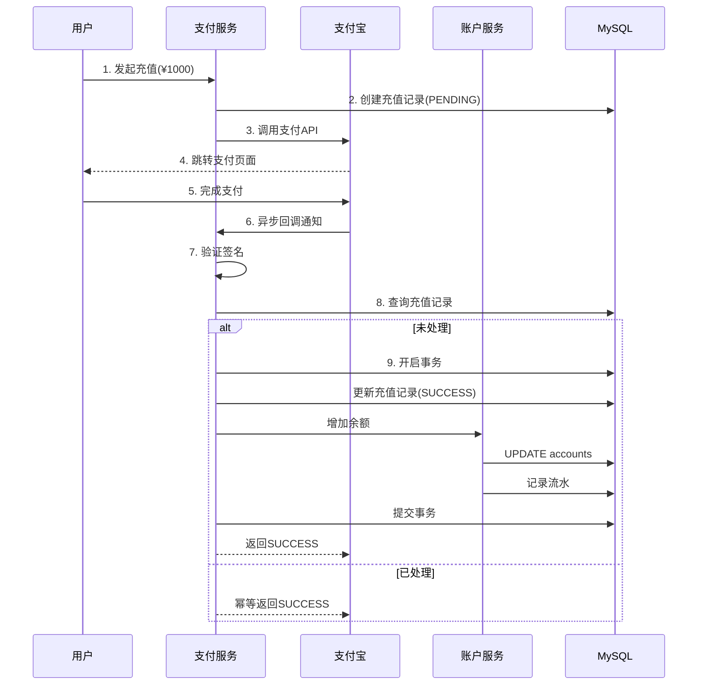
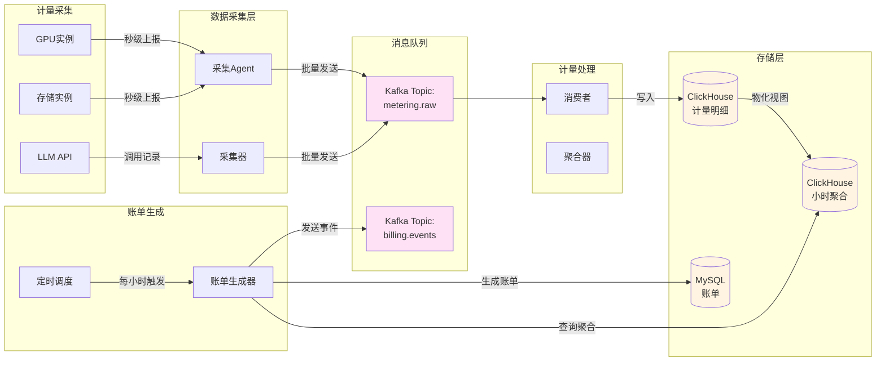
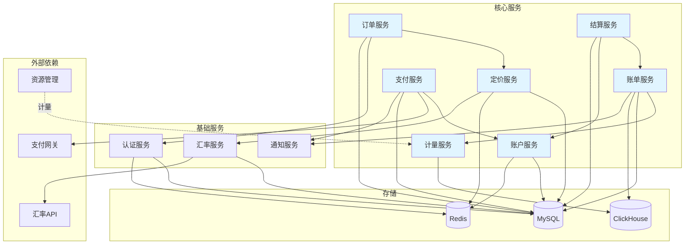
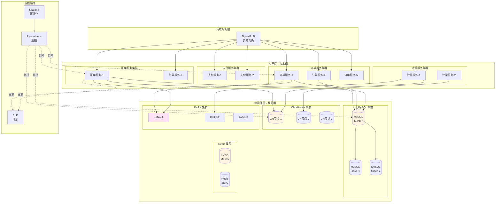
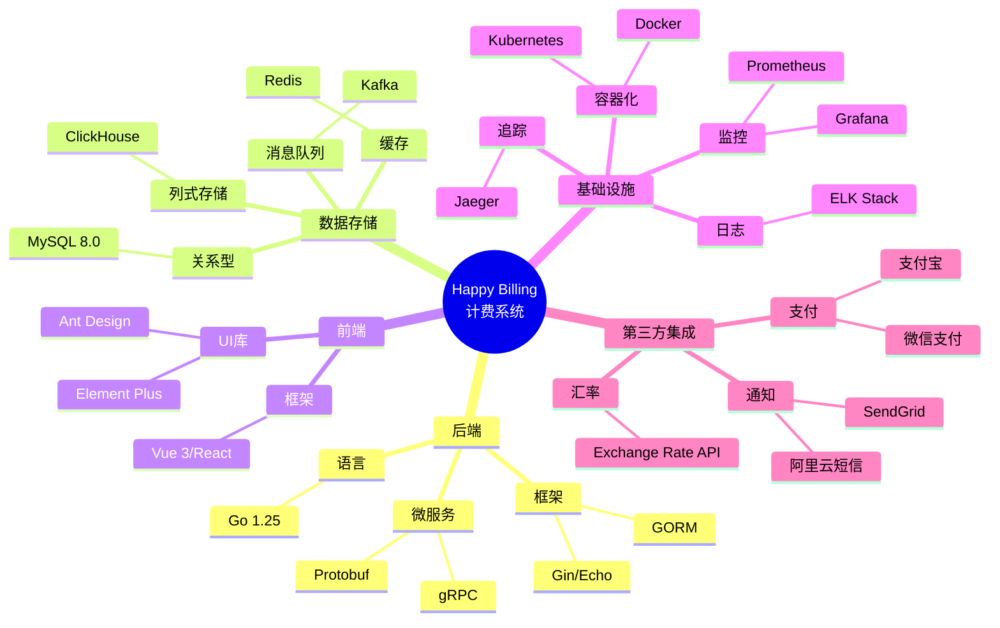

# Happy Billing 订单账单系统设计方案

**设计日期**：2026-01-17
**版本**：v1.0
**设计目标**：为 AI 云 PaaS 平台设计高可扩展、易接入、可插拔的订单账单模型

---

## 业务需求确认

### 核心业务特征
- **产品类型**：GPU 算力、存储、LLM Token
- **计费模式**：混合模式（预付费 + 后付费）
- **计费粒度**：秒级计量，按需聚合
- **定价模型**：完整价格体系（固定价、阶梯价、折扣、资源包、时段定价）
- **租户架构**：完整租户体系（Tenant > Organization > Project > User）
- **结算方式**：企业级结算（在线支付、余额、月结、授信）
- **技术栈**：MySQL + ClickHouse

### 业务规则
1. **包年包月**（预付费）：下单即生成账单，立即支付
2. **按量计费**（后付费）：每小时生成账单汇总
3. **LLM Token**：记录每次调用明细，按小时汇总出账
4. **退款机制**：支持原路退款 + 红冲账单

---

## 第一部分：整体架构概览

### 系统分层架构

```
┌─────────────────────────────────────────────────┐
│          业务接入层 (API Gateway)                │
│  - 订单服务API  - 账单查询API  - 计量上报API    │
└─────────────────────────────────────────────────┘
                        ↓
┌─────────────────────────────────────────────────┐
│               核心业务层                         │
│  ┌──────────┐ ┌──────────┐ ┌──────────┐        │
│  │订单服务  │ │账单服务  │ │计量服务  │        │
│  │Order Svc │ │Bill Svc  │ │Meter Svc │        │
│  └──────────┘ └──────────┘ └──────────┘        │
│  ┌──────────┐ ┌──────────┐ ┌──────────┐        │
│  │定价服务  │ │支付服务  │ │结算服务  │        │
│  │Price Svc │ │Pay Svc   │ │Settle Svc│        │
│  └──────────┘ └──────────┘ └──────────┘        │
└─────────────────────────────────────────────────┘
                        ↓
┌─────────────────────────────────────────────────┐
│               数据存储层                         │
│  ┌──────────────┐      ┌──────────────┐        │
│  │    MySQL     │      │  ClickHouse  │        │
│  │ 业务数据     │      │  计量&账单    │        │
│  │ 订单/用户/   │      │  海量明细     │        │
│  │ 定价规则     │      │  OLAP分析     │        │
│  └──────────────┘      └──────────────┘        │
│  ┌──────────────┐      ┌──────────────┐        │
│  │    Redis     │      │    Kafka     │        │
│  │ 缓存/计数器  │      │  消息队列     │        │
│  └──────────────┘      └──────────────┘        │
└─────────────────────────────────────────────────┘
```

### 核心设计原则

1. **服务职责分离**：订单、计量、账单、定价、支付各自独立，通过事件和API协作
2. **存储分离**：业务数据（MySQL）与海量分析数据（ClickHouse）分离
3. **异步解耦**：计量数据通过 Kafka 异步写入，避免阻塞业务流程
4. **可插拔扩展**：新产品类型通过配置定价规则接入，无需改代码

### 服务职责说明

| 服务 | 职责 | 关键能力 |
|------|------|---------|
| **订单服务** | 处理用户购买行为 | 创建订单、订单状态流转、订单查询 |
| **计量服务** | 采集和聚合资源使用数据 | 实时计量上报、秒级数据聚合、计量查询 |
| **账单服务** | 生成和管理账单 | 按小时出账、红冲账单、账单查询 |
| **定价服务** | 管理价格策略 | 价格计算、折扣规则、资源包配置 |
| **支付服务** | 处理支付和退款 | 在线支付、余额扣减、原路退款 |
| **结算服务** | 企业级结算 | 月结对账、授信管理、发票管理 |

---


## 第二部分：核心数据模型与表关系

### 1. 租户与组织模型

```sql
-- 租户表（顶层隔离）
CREATE TABLE tenants (
  id            BIGINT PRIMARY KEY AUTO_INCREMENT,
  tenant_code   VARCHAR(64) UNIQUE NOT NULL,
  name          VARCHAR(255) NOT NULL,
  status        TINYINT DEFAULT 1,
  created_at    TIMESTAMP DEFAULT CURRENT_TIMESTAMP,
  updated_at    TIMESTAMP DEFAULT CURRENT_TIMESTAMP ON UPDATE CURRENT_TIMESTAMP
);

-- 组织表（企业主体，支持树形结构）
CREATE TABLE organizations (
  id            BIGINT PRIMARY KEY AUTO_INCREMENT,
  tenant_id     BIGINT NOT NULL,
  parent_id     BIGINT,
  org_code      VARCHAR(64) UNIQUE NOT NULL,
  name          VARCHAR(255) NOT NULL,
  org_type      VARCHAR(32),
  created_at    TIMESTAMP DEFAULT CURRENT_TIMESTAMP,
  INDEX idx_tenant_parent (tenant_id, parent_id)
);

-- 项目表（成本中心/工作区）
CREATE TABLE projects (
  id            BIGINT PRIMARY KEY AUTO_INCREMENT,
  tenant_id     BIGINT NOT NULL,
  org_id        BIGINT NOT NULL,
  project_code  VARCHAR(64) UNIQUE NOT NULL,
  name          VARCHAR(255) NOT NULL,
  status        TINYINT DEFAULT 1,
  created_at    TIMESTAMP DEFAULT CURRENT_TIMESTAMP,
  INDEX idx_tenant_org (tenant_id, org_id)
);

-- 用户表
CREATE TABLE users (
  id            BIGINT PRIMARY KEY AUTO_INCREMENT,
  tenant_id     BIGINT NOT NULL,
  user_code     VARCHAR(64) UNIQUE NOT NULL,
  email         VARCHAR(255),
  phone         VARCHAR(32),
  created_at    TIMESTAMP DEFAULT CURRENT_TIMESTAMP,
  INDEX idx_tenant (tenant_id)
);
```

### 2. 核心订单模型

```sql
-- 订单表
CREATE TABLE orders (
  id                BIGINT PRIMARY KEY AUTO_INCREMENT,
  order_no          VARCHAR(64) UNIQUE NOT NULL,
  tenant_id         BIGINT NOT NULL,
  org_id            BIGINT NOT NULL,
  project_id        BIGINT NOT NULL,
  user_id           BIGINT NOT NULL,
  order_type        VARCHAR(32) NOT NULL,
  product_type      VARCHAR(32) NOT NULL,
  original_amount   DECIMAL(18,4) NOT NULL,
  discount_amount   DECIMAL(18,4) DEFAULT 0,
  payable_amount    DECIMAL(18,4) NOT NULL,
  paid_amount       DECIMAL(18,4) DEFAULT 0,
  period_start      TIMESTAMP,
  period_end        TIMESTAMP,
  status            VARCHAR(32) NOT NULL,
  order_detail      JSON,
  created_at        TIMESTAMP DEFAULT CURRENT_TIMESTAMP,
  updated_at        TIMESTAMP DEFAULT CURRENT_TIMESTAMP ON UPDATE CURRENT_TIMESTAMP,
  INDEX idx_tenant_project (tenant_id, project_id),
  INDEX idx_user (user_id),
  INDEX idx_status (status)
);

-- 订单明细表
CREATE TABLE order_items (
  id                BIGINT PRIMARY KEY AUTO_INCREMENT,
  order_id          BIGINT NOT NULL,
  item_no           VARCHAR(64) NOT NULL,
  product_type      VARCHAR(32) NOT NULL,
  product_code      VARCHAR(64) NOT NULL,
  product_spec      JSON,
  quantity          DECIMAL(18,4) NOT NULL,
  unit_price        DECIMAL(18,4) NOT NULL,
  amount            DECIMAL(18,4) NOT NULL,
  price_rule_id     BIGINT,
  created_at        TIMESTAMP DEFAULT CURRENT_TIMESTAMP,
  INDEX idx_order (order_id)
);
```

### 3. 资源实例表

```sql
-- 资源实例表（按量计费需要追踪实例）
CREATE TABLE resource_instances (
  id                BIGINT PRIMARY KEY AUTO_INCREMENT,
  instance_id       VARCHAR(64) UNIQUE NOT NULL,
  order_id          BIGINT NOT NULL,
  tenant_id         BIGINT NOT NULL,
  project_id        BIGINT NOT NULL,
  product_type      VARCHAR(32) NOT NULL,
  product_code      VARCHAR(64) NOT NULL,
  instance_spec     JSON,
  status            VARCHAR(32) NOT NULL,
  started_at        TIMESTAMP,
  stopped_at        TIMESTAMP,
  created_at        TIMESTAMP DEFAULT CURRENT_TIMESTAMP,
  updated_at        TIMESTAMP DEFAULT CURRENT_TIMESTAMP ON UPDATE CURRENT_TIMESTAMP,
  INDEX idx_order (order_id),
  INDEX idx_tenant_project (tenant_id, project_id),
  INDEX idx_status (status)
);
```

### 4. 表关系详解

#### 4.1 租户体系层级关系（树形结构）

```
Tenant (租户)                         [顶层隔离，如：阿里巴巴集团]
  │
  ├─→ Organization (组织)             [如：淘宝事业部]
  │     ├─→ Organization (子组织)     [如：淘宝技术部]
  │     │     └─→ Project (项目)      [如：推荐系统项目]
  │     │
  │     └─→ Project (项目)            [如：电商平台项目]
  │
  └─→ User (用户)                     [用户属于租户，可访问多个项目]
```

**关系代码映射：**
```
tenants.id = organizations.tenant_id          [1:N]
organizations.id = organizations.parent_id    [1:N 树形自关联]
organizations.id = projects.org_id            [1:N]
tenants.id = users.tenant_id                  [1:N]
```

#### 4.2 订单业务核心关系链

```
┌─────────────────────────────────────────────────────────────┐
│                      订单生命周期                            │
└─────────────────────────────────────────────────────────────┘

User 发起购买
   ↓
Orders (订单主表) ──────┬───→ Order Items (订单明细) [1:N]
   │                    │        └─→ Price Rules (定价规则) [N:1]
   │                    │
   ├────────────────────┴───→ Resource Instances (资源实例) [1:N]
   │                               │
   │                               └─→ Metering Records (计量明细-ClickHouse) [1:N]
   │                                        │
   │                                        └─→ Bills (账单汇总) [N:1]
   │
   └──────────────────────────→ Bills (账单) [1:N]
                                    │
                                    └─→ Payments (支付记录) [1:N]
```

**核心关系说明：**

| 关系 | 类型 | 说明 | 示例 |
|------|------|------|------|
| `Order → Order Items` | 1:N | 一个订单包含多个产品明细 | 订单包含：2台GPU + 500GB存储 |
| `Order → Resource Instances` | 1:N | 按量计费订单创建资源实例 | GPU按量订单 → 创建GPU实例 |
| `Resource Instance → Metering Records` | 1:N | 实例产生计量数据（秒级） | 1个GPU实例每天产生86400条计量 |
| `Order → Bills` | 1:N | 订单产生账单 | 包年：1订单→1账单；按量：1订单→N账单/小时 |
| `Order → Tenant/Org/Project` | N:1 | 订单归属组织架构 | 所有订单必须属于某个项目 |

#### 4.3 完整业务场景示例

##### 场景A：企业购买包年GPU（预付费）

**步骤1：用户下单**
```sql
-- 插入订单主表
INSERT INTO orders VALUES (
  order_no: 'ORD20240117001',
  tenant_id: 1001,              -- 阿里巴巴集团
  org_id: 2001,                 -- 淘宝事业部
  project_id: 3001,             -- 推荐系统项目
  user_id: 5001,                -- 张三
  order_type: 'SUBSCRIPTION',   -- 包年包月
  product_type: 'GPU',
  payable_amount: 120000.00,    -- 2台GPU * 12个月 * ¥5000/月
  status: 'PENDING'
);

-- 插入订单明细
INSERT INTO order_items VALUES (
  order_id: 订单ID,
  product_code: 'GPU_A100_40GB',
  quantity: 2,                  -- 2台
  unit_price: 60000.00,         -- 1台1年的价格
  amount: 120000.00
);
```

**步骤2：立即生成账单（预付费特点）**
```sql
-- MySQL bills 表
INSERT INTO bills VALUES (
  bill_no: 'BILL20240117001',
  order_id: 订单ID,
  bill_type: 'SUBSCRIPTION',
  amount: 120000.00,
  status: 'UNPAID'
);
```

**步骤3：用户支付**
```sql
-- 支付成功后
UPDATE bills SET status='PAID' WHERE bill_no='BILL20240117001';
UPDATE orders SET status='PAID' WHERE order_no='ORD20240117001';
```

**步骤4：创建资源实例**
```sql
-- 为用户开通GPU资源
INSERT INTO resource_instances VALUES (
  instance_id: 'GPU-A100-20240117-001',
  order_id: 订单ID,
  tenant_id: 1001,
  project_id: 3001,
  product_code: 'GPU_A100_40GB',
  status: 'RUNNING',
  started_at: '2024-01-17 10:00:00'
);
```

**特点：**
- ✅ 预付费，先支付后使用
- ✅ 服务期内不再出账（已支付整年费用）
- ✅ 可以记录计量数据用于监控，但不用于计费

---

##### 场景B：按量计费使用GPU（后付费）

**步骤1：用户下单**
```sql
INSERT INTO orders VALUES (
  order_no: 'ORD20240117002',
  tenant_id: 1001,
  project_id: 3002,
  order_type: 'PAY_AS_YOU_GO',  -- 按量计费
  product_type: 'GPU',
  payable_amount: 0.00,         -- 初始金额为0，用多少付多少
  status: 'RUNNING'
);
```

**步骤2：创建资源实例**
```sql
INSERT INTO resource_instances VALUES (
  instance_id: 'GPU-A100-20240117-002',
  order_id: 订单ID,
  status: 'RUNNING',
  started_at: '2024-01-17 10:00:00'
);
```

**步骤3：持续计量（写入ClickHouse）**
```sql
-- ClickHouse metering_records 表（秒级数据）
INSERT INTO metering_records VALUES
('2024-01-17 10:00:00', 'GPU-A100-20240117-002', 'gpu_usage', 1.0, 0.0028),  -- ¥10/小时 = ¥0.0028/秒
('2024-01-17 10:00:01', 'GPU-A100-20240117-002', 'gpu_usage', 1.0, 0.0028),
...
('2024-01-17 10:59:59', 'GPU-A100-20240117-002', 'gpu_usage', 1.0, 0.0028);  -- 共3600条
```

**步骤4：每小时生成账单（11:00触发）**
```sql
-- 从ClickHouse聚合计量数据
SELECT 
  instance_id,
  count(*) as seconds_used,
  sum(cost) as total_cost
FROM metering_records
WHERE instance_id = 'GPU-A100-20240117-002'
  AND timestamp >= '2024-01-17 10:00:00'
  AND timestamp < '2024-01-17 11:00:00'
GROUP BY instance_id;

-- 结果：3600秒，¥10.00

-- 插入账单到MySQL
INSERT INTO bills VALUES (
  bill_no: 'BILL20240117002',
  order_id: 订单ID,
  bill_type: 'HOURLY',
  billing_period_start: '2024-01-17 10:00:00',
  billing_period_end: '2024-01-17 11:00:00',
  amount: 10.00,
  status: 'UNPAID'
);
```

**步骤5：结算**
```sql
-- 方式1：从账户余额扣减
UPDATE accounts SET balance = balance - 10.00 WHERE tenant_id=1001;
UPDATE bills SET status='PAID' WHERE bill_no='BILL20240117002';

-- 方式2：或累积到月底统一结算（月结客户）
```

**特点：**
- ✅ 后付费，先使用后结算
- ✅ 每小时生成1条账单（持续产生账单）
- ✅ 计量数据在ClickHouse，账单汇总在MySQL

---

##### 场景C：LLM Token 计费（后付费）

**步骤1：用户开通LLM服务**
```sql
INSERT INTO orders VALUES (
  order_no: 'ORD20240117003',
  order_type: 'PAY_AS_YOU_GO',
  product_type: 'LLM_TOKEN',
  status: 'RUNNING'
);
```

**步骤2：用户调用API，记录计量**
```sql
-- ClickHouse metering_records（每次API调用记录1条）
INSERT INTO metering_records VALUES
('2024-01-17 10:00:15', 'LLM-GPT4-API', 'input_tokens', 100, 0.001),   -- 输入100 token，¥0.001
('2024-01-17 10:00:15', 'LLM-GPT4-API', 'output_tokens', 200, 0.004),  -- 输出200 token，¥0.004
('2024-01-17 10:05:32', 'LLM-GPT4-API', 'input_tokens', 150, 0.0015),
('2024-01-17 10:05:32', 'LLM-GPT4-API', 'output_tokens', 300, 0.006),
...
```

**步骤3：每小时汇总出账**
```sql
-- 11:00触发，聚合10:00~11:00所有API调用
SELECT 
  sum(CASE WHEN metric_type='input_tokens' THEN value ELSE 0 END) as total_input,
  sum(CASE WHEN metric_type='output_tokens' THEN value ELSE 0 END) as total_output,
  sum(cost) as total_cost
FROM metering_records
WHERE timestamp >= '2024-01-17 10:00:00'
  AND timestamp < '2024-01-17 11:00:00'
  AND instance_id LIKE 'LLM-%';

-- 结果：input=50000 tokens, output=80000 tokens, cost=¥5.00

-- 生成账单
INSERT INTO bills VALUES (
  bill_no: 'BILL20240117003',
  order_id: 订单ID,
  bill_type: 'HOURLY',
  amount: 5.00,
  bill_detail: '{"input_tokens":50000,"output_tokens":80000}',
  status: 'UNPAID'
);
```

**特点：**
- ✅ 每次API调用都记录明细（ClickHouse）
- ✅ 按小时汇总，避免账单表数据量爆炸
- ✅ 可追溯每次API调用详情（从ClickHouse查询）

---

#### 4.4 关键设计点说明

##### 1. 为什么订单表要冗余 tenant_id/project_id？

**理由：查询性能和成本分析**

```sql
-- 场景：查询某个项目的所有订单费用
-- ❌ 不冗余的做法（需要多表JOIN）
SELECT sum(o.payable_amount)
FROM orders o
JOIN resource_instances ri ON o.id = ri.order_id
WHERE ri.project_id = 3001;

-- ✅ 冗余后的做法（单表查询）
SELECT sum(payable_amount)
FROM orders
WHERE project_id = 3001;
```

**权衡：**
- 优点：查询快，成本分析方便
- 缺点：数据冗余，但订单数据不常变更，可接受

##### 2. 订单与资源实例的关系

| 订单类型 | 是否创建实例 | 原因 |
|---------|-------------|------|
| 包年GPU | ✅ 创建 | 需要分配实际的GPU资源 |
| 按量GPU | ✅ 创建 | 必须追踪实例的使用时长 |
| 包年存储 | ✅ 创建 | 需要分配存储空间 |
| 按量存储 | ✅ 创建 | 追踪存储使用量 |
| Token资源包 | ❌ 不创建 | 只是购买配额，无实际实例 |
| 按量LLM | ❌ 不创建 | API调用，无需实例（或共享实例） |

##### 3. 订单与账单的关系

| 计费模式 | 订单:账单关系 | 出账时机 | 示例 |
|---------|-------------|---------|------|
| 包年包月 | 1:1 | 下单时 | 购买年卡，立即生成1张年费账单 |
| 按量计费 | 1:N | 每小时 | 按量GPU，每小时生成1张账单 |
| 资源包 | 1:1 | 下单时 | 购买10万Token，立即生成1张账单 |

##### 4. 计量数据与账单数据的分离

```
计量数据 (ClickHouse)          账单数据 (MySQL)
━━━━━━━━━━━━━━━━━            ━━━━━━━━━━━━━━
秒级明细（海量）      ─聚合→   小时/天/月账单（汇总）
10:00:00 - GPU使用                11:00 生成账单
10:00:01 - GPU使用                金额：¥10.00
...                              
10:59:59 - GPU使用    
（3600条记录）                   （1条记录）
```

**分离的好处：**
- ✅ ClickHouse 擅长海量时序数据存储和聚合
- ✅ MySQL 存储业务账单，支持事务和关联查询
- ✅ 计量明细可以定期归档，账单永久保留

---


### 5. 账号系统：兼容企业与个人用户

#### 5.1 用户类型设计

系统需要同时支持两种用户类型：

| 用户类型 | 典型场景 | 组织架构需求 | 实名认证 |
|---------|---------|-------------|---------|
| **企业用户** | 大中型企业 | 需要多层级组织、部门、项目 | 企业认证 |
| **个人开发者** | 独立开发者、小型团队 | 无需复杂组织结构 | 个人实名认证 |

#### 5.2 统一租户模型（推荐方案）

**核心思想：个人用户也走租户体系，但自动简化**

```sql
-- 扩展租户表，增加租户类型
CREATE TABLE tenants (
  id            BIGINT PRIMARY KEY AUTO_INCREMENT,
  tenant_code   VARCHAR(64) UNIQUE NOT NULL,
  name          VARCHAR(255) NOT NULL,
  tenant_type   VARCHAR(32) NOT NULL,              -- 'ENTERPRISE'(企业), 'INDIVIDUAL'(个人)
  
  -- 认证信息
  verified      TINYINT DEFAULT 0,                 -- 是否已认证
  verified_type VARCHAR(32),                       -- 'ENTERPRISE_LICENSE'(企业营业执照), 'ID_CARD'(个人身份证)
  verified_at   TIMESTAMP,
  verified_info JSON,                              -- 认证详情：{"real_name":"张三","id_card":"110***"}
  
  status        TINYINT DEFAULT 1,
  created_at    TIMESTAMP DEFAULT CURRENT_TIMESTAMP,
  updated_at    TIMESTAMP DEFAULT CURRENT_TIMESTAMP ON UPDATE CURRENT_TIMESTAMP,
  
  INDEX idx_type (tenant_type)
);

-- 用户表扩展，增加是否为主账号标识
CREATE TABLE users (
  id            BIGINT PRIMARY KEY AUTO_INCREMENT,
  tenant_id     BIGINT NOT NULL,
  user_code     VARCHAR(64) UNIQUE NOT NULL,
  
  -- 个人用户特有字段
  is_primary    TINYINT DEFAULT 0,                 -- 是否为租户主账号（个人用户=1）
  real_name     VARCHAR(128),                      -- 实名
  id_card       VARCHAR(64),                       -- 身份证号（加密存储）
  
  email         VARCHAR(255),
  phone         VARCHAR(32),
  created_at    TIMESTAMP DEFAULT CURRENT_TIMESTAMP,
  
  INDEX idx_tenant (tenant_id),
  INDEX idx_primary (tenant_id, is_primary)
);
```

#### 5.3 个人用户注册流程

```
个人用户注册
    ↓
自动创建租户
  - tenant_type = 'INDIVIDUAL'
  - name = 用户昵称
    ↓
自动创建默认组织
  - org_code = tenant_code + '_default'
  - name = '个人工作区'
    ↓
自动创建默认项目
  - project_code = 'default'
  - name = '默认项目'
    ↓
创建用户账号
  - is_primary = 1
  - 关联到默认项目
    ↓
实名认证（下单前必须完成）
  - 提交身份证信息
  - verified = 1
  - verified_type = 'ID_CARD'
```

**代码示例：**
```go
// 个人用户注册
func RegisterIndividual(name, email, phone string) error {
    tx.Begin()
    
    // 1. 创建租户
    tenant := Tenant{
        TenantCode: generateCode("IND"),  // IND20240117001
        Name:       name,
        TenantType: "INDIVIDUAL",
        Verified:   false,
    }
    tenantID := db.Insert(tenant)
    
    // 2. 自动创建默认组织
    org := Organization{
        TenantID: tenantID,
        OrgCode:  tenant.TenantCode + "_default",
        Name:     "个人工作区",
        OrgType:  "personal",
    }
    orgID := db.Insert(org)
    
    // 3. 自动创建默认项目
    project := Project{
        TenantID:    tenantID,
        OrgID:       orgID,
        ProjectCode: "default",
        Name:        "默认项目",
    }
    projectID := db.Insert(project)
    
    // 4. 创建用户（主账号）
    user := User{
        TenantID:  tenantID,
        UserCode:  generateCode("USR"),
        IsPrimary: 1,  // 标记为主账号
        Email:     email,
        Phone:     phone,
    }
    db.Insert(user)
    
    tx.Commit()
}
```

#### 5.4 实名认证流程

```sql
-- 实名认证记录表
CREATE TABLE verifications (
  id              BIGINT PRIMARY KEY AUTO_INCREMENT,
  tenant_id       BIGINT NOT NULL,
  user_id         BIGINT NOT NULL,
  
  verify_type     VARCHAR(32) NOT NULL,            -- 'INDIVIDUAL', 'ENTERPRISE'
  
  -- 个人认证
  real_name       VARCHAR(128),
  id_card         VARCHAR(64),                     -- 加密存储
  id_card_front   VARCHAR(512),                    -- 身份证正面照片URL
  id_card_back    VARCHAR(512),                    -- 身份证反面照片URL
  
  -- 企业认证
  company_name    VARCHAR(255),
  credit_code     VARCHAR(64),                     -- 统一社会信用代码
  license_url     VARCHAR(512),                    -- 营业执照照片URL
  
  -- 认证状态
  status          VARCHAR(32) NOT NULL,            -- 'PENDING', 'APPROVED', 'REJECTED'
  reject_reason   TEXT,
  
  verified_at     TIMESTAMP,
  created_at      TIMESTAMP DEFAULT CURRENT_TIMESTAMP,
  
  INDEX idx_tenant (tenant_id),
  INDEX idx_status (status)
);
```

**认证流程：**
```
用户提交认证 → 审核系统（人工/OCR自动） → 审核通过 → 更新租户verified=1 → 允许下单
```

**下单校验：**
```go
func CreateOrder(tenantID int64, orderReq OrderRequest) error {
    // 检查租户是否已认证
    tenant := db.GetTenant(tenantID)
    if !tenant.Verified {
        return errors.New("请先完成实名认证")
    }
    
    // 继续创建订单...
}
```

#### 5.5 企业用户 vs 个人用户对比

| 维度 | 企业用户 | 个人用户 |
|------|---------|---------|
| **租户** | 1个企业 = 1个租户 | 1个人 = 1个租户 |
| **组织** | 多层级（总公司-子公司-部门） | 自动创建1个"个人工作区" |
| **项目** | 多个项目（成本中心） | 默认1个项目，可创建多个 |
| **用户** | 多个员工账号 | 主账号1个，可邀请协作者 |
| **认证** | 企业营业执照 | 个人身份证 |
| **结算** | 支持月结、授信 | 仅余额、在线支付 |
| **发票** | 增值税专用发票 | 增值税普通发票 |

#### 5.6 个人用户升级为企业

```sql
-- 升级流程
UPDATE tenants SET 
  tenant_type = 'ENTERPRISE',
  verified = 0  -- 需要重新认证企业信息
WHERE id = 个人租户ID;

-- 提交企业认证
INSERT INTO verifications (
  tenant_id, 
  verify_type = 'ENTERPRISE',
  company_name = '北京某某科技有限公司',
  credit_code = '91110***',
  ...
);

-- 认证通过后，个人的历史订单、账单、余额全部保留
-- 可以创建新的组织、项目、邀请员工
```

#### 5.7 数据隔离与权限

```sql
-- 权限控制表（简化）
CREATE TABLE user_project_roles (
  id          BIGINT PRIMARY KEY AUTO_INCREMENT,
  user_id     BIGINT NOT NULL,
  project_id  BIGINT NOT NULL,
  role        VARCHAR(32) NOT NULL,              -- 'OWNER', 'ADMIN', 'MEMBER', 'VIEWER'
  created_at  TIMESTAMP DEFAULT CURRENT_TIMESTAMP,
  
  UNIQUE KEY uk_user_project (user_id, project_id),
  INDEX idx_project (project_id)
);
```

**权限示例：**
- **个人用户**：默认是自己项目的 OWNER
- **企业用户**：
  - 创建订单：需要项目 ADMIN 权限
  - 查看账单：需要项目 VIEWER 权限
  - 财务结算：需要租户级别 FINANCE 角色

#### 5.8 完整示例场景

##### 场景D：个人开发者购买GPU

```
1️⃣ 注册
  - 手机号注册
  - 自动创建：租户(IND001) → 组织(个人工作区) → 项目(default)

2️⃣ 实名认证
  - 上传身份证照片
  - OCR识别：姓名=张三，身份证号=110***
  - 审核通过

3️⃣ 充值
  - 支付宝充值 ¥1000
  - account.balance = 1000.00

4️⃣ 下单购买按量GPU
  - 创建订单：order_type='PAY_AS_YOU_GO', product='GPU_A100'
  - 创建实例：GPU-A100-001
  - 开始计量

5️⃣ 每小时出账
  - 11:00 生成账单 ¥10，从余额扣减
  - account.balance = 990.00
  
6️⃣ 查看账单
  - 用户查询自己项目下的所有账单
  - 明细：GPU使用 3600秒，¥10.00
```

##### 场景E：个人用户邀请协作者

```sql
-- 个人用户可以邀请朋友一起使用项目
INSERT INTO users VALUES (
  tenant_id: 个人用户的租户ID,
  user_code: 'USR002',
  is_primary: 0,  -- 非主账号
  email: 'friend@example.com'
);

INSERT INTO user_project_roles VALUES (
  user_id: USR002,
  project_id: default项目ID,
  role: 'MEMBER'  -- 协作者角色
);
```

**权限效果：**
- 主账号（张三）：OWNER，可以创建订单、充值、查看账单
- 协作者（朋友）：MEMBER，可以使用GPU资源，但不能查看账单

---

### 5.9 设计总结

**核心设计原则：**
1. ✅ **统一模型**：企业和个人都走租户体系，保持代码逻辑一致
2. ✅ **自动简化**：个人用户注册时自动创建默认组织和项目，用户无感知
3. ✅ **灵活扩展**：个人用户可以创建多项目，也可以升级为企业
4. ✅ **安全合规**：实名认证是下单前置条件，满足监管要求

**数据结构优势：**
- 个人用户的订单、账单、计量数据结构与企业完全一致
- 后续做成本分析、BI报表时，无需区分用户类型
- 个人升级企业时，历史数据无缝迁移


---

## 第三部分：定价模型设计

### 1. 定价模型概述

支持多种定价策略的可插拔定价引擎：

| 定价类型 | 说明 | 典型场景 |
|---------|------|---------|
| **固定价格** | 统一单价 | GPU A100: ¥10/小时 |
| **阶梯价格** | 用量越大单价越低 | 存储：0-100GB ¥0.5/GB，100GB+ ¥0.3/GB |
| **时段价格** | 不同时段不同价格 | 夜间GPU: ¥6/小时，白天 ¥10/小时 |
| **资源包** | 预购买优惠包 | 10万Token资源包 ¥80（原价¥100） |
| **折扣规则** | 用户级折扣、促销折扣 | 企业客户8折、新用户首月7折 |

### 2. 核心定价表设计

#### 2.1 产品定义表

```sql
-- 产品目录表（定义有哪些产品）
CREATE TABLE products (
  id              BIGINT PRIMARY KEY AUTO_INCREMENT,
  product_code    VARCHAR(64) UNIQUE NOT NULL,      -- 产品编码：GPU_A100_40GB
  product_name    VARCHAR(255) NOT NULL,            -- 产品名称：NVIDIA A100 40GB
  product_type    VARCHAR(32) NOT NULL,             -- 产品类型：GPU, STORAGE, LLM_TOKEN
  category        VARCHAR(64),                      -- 分类：COMPUTE, STORAGE, AI_SERVICE
  
  -- 产品规格（JSON存储灵活属性）
  spec            JSON,                             -- {"gpu_memory":"40GB","cuda_cores":6912}
  
  -- 计量单位
  unit            VARCHAR(32) NOT NULL,             -- 计量单位：HOUR(小时), GB(存储), TOKEN(令牌), SECOND(秒)
  
  status          TINYINT DEFAULT 1,                -- 1:上架 0:下架
  created_at      TIMESTAMP DEFAULT CURRENT_TIMESTAMP,
  updated_at      TIMESTAMP DEFAULT CURRENT_TIMESTAMP ON UPDATE CURRENT_TIMESTAMP,
  
  INDEX idx_type (product_type),
  INDEX idx_status (status)
);
```

**示例数据：**
```sql
INSERT INTO products VALUES
(1, 'GPU_A100_40GB', 'NVIDIA A100 40GB', 'GPU', 'COMPUTE', '{"memory":"40GB"}', 'HOUR', 1),
(2, 'GPU_V100_32GB', 'NVIDIA V100 32GB', 'GPU', 'COMPUTE', '{"memory":"32GB"}', 'HOUR', 1),
(3, 'STORAGE_SSD', 'SSD云存储', 'STORAGE', 'STORAGE', '{"type":"ssd"}', 'GB', 1),
(4, 'LLM_GPT4', 'GPT-4 API', 'LLM_TOKEN', 'AI_SERVICE', '{"model":"gpt-4"}', 'TOKEN', 1);
```

#### 2.2 定价规则表（核心）

```sql
-- 定价规则表（可插拔的定价策略）
CREATE TABLE price_rules (
  id              BIGINT PRIMARY KEY AUTO_INCREMENT,
  rule_code       VARCHAR(64) UNIQUE NOT NULL,      -- 规则编码：PRICE_GPU_A100_2024Q1
  rule_name       VARCHAR(255) NOT NULL,            -- 规则名称
  product_code    VARCHAR(64) NOT NULL,             -- 关联产品
  
  -- 规则类型
  rule_type       VARCHAR(32) NOT NULL,             -- 'FIXED'(固定价), 'TIERED'(阶梯价), 'TIME_BASED'(时段价), 'PACKAGE'(资源包)
  
  -- 定价详情（JSON存储，不同类型规则结构不同）
  pricing_detail  JSON NOT NULL,
  
  -- 生效时间
  effective_start TIMESTAMP NOT NULL,               -- 生效开始时间
  effective_end   TIMESTAMP,                        -- 生效结束时间（NULL表示永久）
  
  -- 适用范围
  region          VARCHAR(64),                      -- 适用地域：cn-beijing, us-west
  
  priority        INT DEFAULT 0,                    -- 优先级（多个规则时选择优先级最高的）
  status          TINYINT DEFAULT 1,                -- 1:启用 0:禁用
  
  created_at      TIMESTAMP DEFAULT CURRENT_TIMESTAMP,
  updated_at      TIMESTAMP DEFAULT CURRENT_TIMESTAMP ON UPDATE CURRENT_TIMESTAMP,
  
  INDEX idx_product (product_code),
  INDEX idx_type (rule_type),
  INDEX idx_effective (effective_start, effective_end),
  INDEX idx_priority (priority)
);
```

#### 2.3 不同定价类型的 JSON 结构

##### 固定价格（FIXED）

```json
{
  "unit_price": 10.00,
  "currency": "CNY"
}
```

**示例：**
```sql
-- GPU A100 固定价格 ¥10/小时
INSERT INTO price_rules VALUES (
  rule_code: 'PRICE_GPU_A100_FIXED',
  product_code: 'GPU_A100_40GB',
  rule_type: 'FIXED',
  pricing_detail: '{"unit_price":10.00,"currency":"CNY"}',
  effective_start: '2024-01-01 00:00:00',
  effective_end: NULL,
  priority: 10
);
```

##### 阶梯价格（TIERED）

```json
{
  "currency": "CNY",
  "tiers": [
    {
      "min": 0,
      "max": 100,
      "unit_price": 0.50,
      "description": "0-100GB"
    },
    {
      "min": 100,
      "max": 1000,
      "unit_price": 0.40,
      "description": "100-1000GB"
    },
    {
      "min": 1000,
      "max": null,
      "unit_price": 0.30,
      "description": "1000GB以上"
    }
  ]
}
```

**示例：**
```sql
-- 存储阶梯价格
INSERT INTO price_rules VALUES (
  rule_code: 'PRICE_STORAGE_TIERED',
  product_code: 'STORAGE_SSD',
  rule_type: 'TIERED',
  pricing_detail: '{
    "currency":"CNY",
    "tiers":[
      {"min":0,"max":100,"unit_price":0.50},
      {"min":100,"max":1000,"unit_price":0.40},
      {"min":1000,"max":null,"unit_price":0.30}
    ]
  }',
  effective_start: '2024-01-01 00:00:00',
  priority: 10
);
```

**计算逻辑：**
```go
// 用户使用了 1500GB 存储
func CalculateTieredPrice(usage float64, tiers []Tier) float64 {
    totalCost := 0.0
    remaining := usage
    
    for _, tier := range tiers {
        tierSize := tier.Max - tier.Min
        if tier.Max == nil || remaining <= tierSize {
            // 最后一档或剩余用量不足一档
            totalCost += remaining * tier.UnitPrice
            break
        } else {
            totalCost += tierSize * tier.UnitPrice
            remaining -= tierSize
        }
    }
    return totalCost
}

// 示例：1500GB 存储成本
// 0-100GB:    100 * 0.50 = 50
// 100-1000GB: 900 * 0.40 = 360
// 1000-1500GB: 500 * 0.30 = 150
// 总计：560元
```

##### 时段价格（TIME_BASED）

```json
{
  "currency": "CNY",
  "time_slots": [
    {
      "name": "峰时",
      "start_hour": 8,
      "end_hour": 20,
      "unit_price": 10.00
    },
    {
      "name": "谷时",
      "start_hour": 20,
      "end_hour": 8,
      "unit_price": 6.00
    }
  ]
}
```

**示例：**
```sql
-- GPU 分时定价
INSERT INTO price_rules VALUES (
  rule_code: 'PRICE_GPU_A100_TIME',
  product_code: 'GPU_A100_40GB',
  rule_type: 'TIME_BASED',
  pricing_detail: '{
    "currency":"CNY",
    "time_slots":[
      {"name":"峰时","start_hour":8,"end_hour":20,"unit_price":10.00},
      {"name":"谷时","start_hour":20,"end_hour":8,"unit_price":6.00}
    ]
  }',
  effective_start: '2024-01-01 00:00:00',
  priority: 20  -- 优先级高于固定价格
);
```

**计算逻辑：**
```go
// GPU使用从 19:00 到 21:00（跨时段）
// 19:00-20:00: 峰时 1小时 * ¥10 = ¥10
// 20:00-21:00: 谷时 1小时 * ¥6 = ¥6
// 总计：¥16
```

##### 资源包价格（PACKAGE）

```json
{
  "currency": "CNY",
  "package_type": "TOKEN",
  "package_amount": 100000,
  "package_price": 80.00,
  "original_price": 100.00,
  "validity_days": 365
}
```

**示例：**
```sql
-- LLM Token 资源包
INSERT INTO price_rules VALUES (
  rule_code: 'PACKAGE_LLM_100K',
  product_code: 'LLM_GPT4',
  rule_type: 'PACKAGE',
  pricing_detail: '{
    "currency":"CNY",
    "package_type":"TOKEN",
    "package_amount":100000,
    "package_price":80.00,
    "original_price":100.00,
    "validity_days":365
  }',
  effective_start: '2024-01-01 00:00:00',
  priority: 10
);
```

#### 2.4 折扣规则表

```sql
-- 折扣规则表
CREATE TABLE discount_rules (
  id              BIGINT PRIMARY KEY AUTO_INCREMENT,
  discount_code   VARCHAR(64) UNIQUE NOT NULL,      -- 折扣编码：DISCOUNT_ENTERPRISE_20
  discount_name   VARCHAR(255) NOT NULL,            -- 折扣名称：企业客户折扣
  
  -- 折扣类型
  discount_type   VARCHAR(32) NOT NULL,             -- 'PERCENTAGE'(百分比), 'FIXED_AMOUNT'(固定金额), 'COUPON'(优惠券)
  
  -- 折扣值
  discount_value  DECIMAL(18,4) NOT NULL,           -- 百分比：0.20(8折), 固定金额：50.00
  
  -- 适用范围
  product_codes   JSON,                             -- 适用产品：["GPU_A100","GPU_V100"] 或 null(全产品)
  tenant_ids      JSON,                             -- 适用租户：[1001,1002] 或 null(全租户)
  
  -- 生效条件
  min_amount      DECIMAL(18,4),                    -- 最低消费金额
  max_discount    DECIMAL(18,4),                    -- 最大折扣金额
  
  -- 生效时间
  effective_start TIMESTAMP NOT NULL,
  effective_end   TIMESTAMP,
  
  -- 使用限制
  usage_limit     INT,                              -- 使用次数限制（优惠券）
  used_count      INT DEFAULT 0,                    -- 已使用次数
  
  status          TINYINT DEFAULT 1,
  created_at      TIMESTAMP DEFAULT CURRENT_TIMESTAMP,
  updated_at      TIMESTAMP DEFAULT CURRENT_TIMESTAMP ON UPDATE CURRENT_TIMESTAMP,
  
  INDEX idx_type (discount_type),
  INDEX idx_effective (effective_start, effective_end)
);
```

**折扣示例：**

```sql
-- 1. 企业客户全场8折（百分比折扣）
INSERT INTO discount_rules VALUES (
  discount_code: 'DISCOUNT_ENTERPRISE',
  discount_name: '企业客户折扣',
  discount_type: 'PERCENTAGE',
  discount_value: 0.20,  -- 打8折（优惠20%）
  product_codes: NULL,   -- 全产品
  tenant_ids: '[1001,1002,1003]',  -- 指定租户
  effective_start: '2024-01-01 00:00:00'
);

-- 2. 新用户首月优惠券（固定金额）
INSERT INTO discount_rules VALUES (
  discount_code: 'COUPON_NEW_USER',
  discount_name: '新用户首月50元优惠券',
  discount_type: 'FIXED_AMOUNT',
  discount_value: 50.00,
  min_amount: 100.00,    -- 满100可用
  max_discount: 50.00,
  usage_limit: 1,        -- 仅可使用1次
  effective_start: '2024-01-01 00:00:00',
  effective_end: '2024-12-31 23:59:59'
);

-- 3. GPU产品促销（百分比折扣）
INSERT INTO discount_rules VALUES (
  discount_code: 'PROMO_GPU_Q1',
  discount_name: 'Q1 GPU促销7折',
  discount_type: 'PERCENTAGE',
  discount_value: 0.30,  -- 打7折（优惠30%）
  product_codes: '["GPU_A100_40GB","GPU_V100_32GB"]',
  effective_start: '2024-01-01 00:00:00',
  effective_end: '2024-03-31 23:59:59'
);
```

### 3. 定价计算引擎

#### 3.1 价格计算流程

```
订单请求
   ↓
1. 查询产品基础价格规则（price_rules）
   - 按 product_code 查询
   - 按 effective_start/end 过滤有效规则
   - 按 priority 排序，取最高优先级
   ↓
2. 根据规则类型计算基础价格
   - FIXED: 直接取 unit_price
   - TIERED: 按阶梯计算
   - TIME_BASED: 按时段计算
   - PACKAGE: 资源包价格
   ↓
3. 应用折扣规则（discount_rules）
   - 查询租户可用折扣
   - 按优先级排序（用户手动选择或自动应用最优）
   - 计算折扣后价格
   ↓
4. 返回最终价格
   - original_amount: 原价
   - discount_amount: 折扣金额
   - payable_amount: 应付金额
```

#### 3.2 价格计算示例代码

```go
// 价格计算引擎
type PricingEngine struct {
    db *Database
}

// 计算订单价格
func (e *PricingEngine) CalculatePrice(req PriceRequest) (*PriceResult, error) {
    // 1. 查询适用的价格规则
    rule := e.findApplicablePriceRule(
        req.ProductCode,
        req.Region,
        req.Timestamp,
    )
    
    // 2. 根据规则类型计算基础价格
    var basePrice float64
    switch rule.RuleType {
    case "FIXED":
        basePrice = e.calculateFixedPrice(rule, req.Quantity)
    case "TIERED":
        basePrice = e.calculateTieredPrice(rule, req.Quantity)
    case "TIME_BASED":
        basePrice = e.calculateTimeBasedPrice(rule, req.StartTime, req.EndTime)
    case "PACKAGE":
        basePrice = e.calculatePackagePrice(rule)
    }
    
    // 3. 应用折扣
    discounts := e.findApplicableDiscounts(
        req.TenantID,
        req.ProductCode,
        basePrice,
    )
    
    totalDiscount := 0.0
    for _, discount := range discounts {
        totalDiscount += e.calculateDiscount(discount, basePrice)
    }
    
    // 4. 返回价格详情
    return &PriceResult{
        OriginalAmount: basePrice,
        DiscountAmount: totalDiscount,
        PayableAmount:  basePrice - totalDiscount,
        PriceRuleID:    rule.ID,
        DiscountIDs:    getDiscountIDs(discounts),
    }
}

// 查询适用的价格规则
func (e *PricingEngine) findApplicablePriceRule(
    productCode, region string,
    timestamp time.Time,
) *PriceRule {
    query := `
        SELECT * FROM price_rules
        WHERE product_code = ?
          AND status = 1
          AND effective_start <= ?
          AND (effective_end IS NULL OR effective_end >= ?)
          AND (region IS NULL OR region = ?)
        ORDER BY priority DESC, id DESC
        LIMIT 1
    `
    
    var rule PriceRule
    e.db.QueryRow(query, productCode, timestamp, timestamp, region).Scan(&rule)
    return &rule
}

// 计算阶梯价格
func (e *PricingEngine) calculateTieredPrice(rule *PriceRule, quantity float64) float64 {
    var detail TieredPricing
    json.Unmarshal([]byte(rule.PricingDetail), &detail)
    
    totalCost := 0.0
    remaining := quantity
    
    for _, tier := range detail.Tiers {
        var tierSize float64
        if tier.Max == nil {
            tierSize = remaining
        } else {
            tierSize = min(*tier.Max - tier.Min, remaining)
        }
        
        totalCost += tierSize * tier.UnitPrice
        remaining -= tierSize
        
        if remaining <= 0 {
            break
        }
    }
    
    return totalCost
}
```

---


### 4. 产品模型重构：引入 SPU/SKU 体系

#### 4.1 为什么需要 SPU/SKU？

**当前设计的问题：**
```sql
-- ❌ 扁平化设计，产品信息混乱
products (
  product_code: 'GPU_A100_40GB',     -- 规格和产品混在一起
  product_code: 'GPU_A100_80GB',     -- 重复的产品信息
  product_code: 'GPU_V100_32GB',
  ...
)
```

**问题：**
1. GPU A100 的通用信息（品牌、厂商、用途）需要在每个规格中重复维护
2. 无法灵活管理不同地域、不同规格的定价
3. 产品查询和筛选困难（用户想看"所有 GPU A100 的规格"）

---

#### 4.2 SPU/SKU 概念在云计费中的应用

| 层级 | 名称 | 说明 | 云计费示例 |
|------|------|------|-----------|
| **SPU** | 标准化产品单元 | 产品类别，定义通用属性 | GPU A100（不含规格） |
| **SKU** | 库存量单位 | 具体可售卖的商品，包含所有规格 | GPU A100 40GB 北京区 |

**关系：**
```
SPU: GPU A100
  ├─ SKU: GPU A100 40GB 北京区
  ├─ SKU: GPU A100 40GB 上海区
  ├─ SKU: GPU A100 80GB 北京区
  └─ SKU: GPU A100 80GB 上海区

SPU: 对象存储
  ├─ SKU: 标准存储 北京区
  ├─ SKU: 标准存储 上海区
  ├─ SKU: 低频存储 北京区
  └─ SKU: 归档存储 北京区
```

---

#### 4.3 重构后的产品表设计

##### SPU 表（产品主表）

```sql
-- SPU 表：标准化产品单元
CREATE TABLE product_spu (
  id              BIGINT PRIMARY KEY AUTO_INCREMENT,
  spu_code        VARCHAR(64) UNIQUE NOT NULL,      -- SPU编码：SPU_GPU_A100
  spu_name        VARCHAR(255) NOT NULL,            -- SPU名称：NVIDIA A100 GPU
  
  -- 产品分类
  category_id     BIGINT NOT NULL,                  -- 关联产品分类
  product_type    VARCHAR(32) NOT NULL,             -- GPU, STORAGE, LLM_TOKEN
  
  -- SPU 通用属性（所有 SKU 共享）
  brand           VARCHAR(128),                     -- 品牌：NVIDIA
  manufacturer    VARCHAR(128),                     -- 厂商：NVIDIA
  description     TEXT,                             -- 产品描述
  
  -- 规格模板（定义该 SPU 下 SKU 可配置的规格项）
  spec_template   JSON,                             -- {"memory":["40GB","80GB"],"region":["cn-beijing","cn-shanghai"]}
  
  -- 计量单位（SPU 级别统一）
  billing_unit    VARCHAR(32) NOT NULL,             -- HOUR, GB, TOKEN, SECOND
  
  -- 图片和文档
  images          JSON,                             -- ["https://cdn.com/gpu-a100.png"]
  docs_url        VARCHAR(512),                     -- 产品文档链接
  
  status          TINYINT DEFAULT 1,                -- 1:上架 0:下架
  created_at      TIMESTAMP DEFAULT CURRENT_TIMESTAMP,
  updated_at      TIMESTAMP DEFAULT CURRENT_TIMESTAMP ON UPDATE CURRENT_TIMESTAMP,
  
  INDEX idx_category (category_id),
  INDEX idx_type (product_type),
  INDEX idx_status (status)
);
```

**示例数据：**
```sql
INSERT INTO product_spu VALUES (
  spu_code: 'SPU_GPU_A100',
  spu_name: 'NVIDIA A100 GPU',
  category_id: 1,  -- GPU计算分类
  product_type: 'GPU',
  brand: 'NVIDIA',
  manufacturer: 'NVIDIA Corporation',
  description: 'NVIDIA A100 Tensor Core GPU，适用于AI训练和推理',
  spec_template: '{
    "memory": ["40GB", "80GB"],
    "region": ["cn-beijing", "cn-shanghai", "us-west"],
    "network": ["25Gbps", "100Gbps"]
  }',
  billing_unit: 'HOUR',
  status: 1
);
```

##### SKU 表（具体商品）

```sql
-- SKU 表：库存量单位（实际可售卖的商品）
CREATE TABLE product_sku (
  id              BIGINT PRIMARY KEY AUTO_INCREMENT,
  sku_code        VARCHAR(64) UNIQUE NOT NULL,      -- SKU编码：SKU_GPU_A100_40GB_BJ
  sku_name        VARCHAR(255) NOT NULL,            -- SKU名称：A100 40GB 北京区
  
  spu_id          BIGINT NOT NULL,                  -- 关联 SPU
  spu_code        VARCHAR(64) NOT NULL,             -- 冗余 SPU 编码（查询优化）
  
  -- SKU 具体规格（JSON 存储）
  spec_values     JSON NOT NULL,                    -- {"memory":"40GB","region":"cn-beijing","network":"25Gbps"}
  
  -- SKU 独有属性
  region          VARCHAR(64),                      -- 地域（从 spec_values 中提取，便于查询）
  zone            VARCHAR(64),                      -- 可用区：cn-beijing-a
  
  -- 库存信息（如果需要）
  stock_type      VARCHAR(32),                      -- 'UNLIMITED'(无限), 'LIMITED'(有限)
  available_stock INT,                              -- 可用库存（仅 LIMITED 时有效）
  
  -- SKU 状态
  status          TINYINT DEFAULT 1,                -- 1:可售 0:售罄 -1:下架
  sale_start      TIMESTAMP,                        -- 开售时间
  sale_end        TIMESTAMP,                        -- 停售时间
  
  created_at      TIMESTAMP DEFAULT CURRENT_TIMESTAMP,
  updated_at      TIMESTAMP DEFAULT CURRENT_TIMESTAMP ON UPDATE CURRENT_TIMESTAMP,
  
  INDEX idx_spu (spu_id, spu_code),
  INDEX idx_region (region),
  INDEX idx_status (status)
);
```

**示例数据：**
```sql
-- GPU A100 的不同 SKU
INSERT INTO product_sku VALUES
(
  sku_code: 'SKU_GPU_A100_40GB_BJ',
  sku_name: 'A100 40GB 北京区',
  spu_id: 1,
  spu_code: 'SPU_GPU_A100',
  spec_values: '{"memory":"40GB","region":"cn-beijing","network":"25Gbps"}',
  region: 'cn-beijing',
  zone: 'cn-beijing-a',
  stock_type: 'LIMITED',
  available_stock: 100,
  status: 1
),
(
  sku_code: 'SKU_GPU_A100_80GB_BJ',
  sku_name: 'A100 80GB 北京区',
  spu_id: 1,
  spu_code: 'SPU_GPU_A100',
  spec_values: '{"memory":"80GB","region":"cn-beijing","network":"100Gbps"}',
  region: 'cn-beijing',
  stock_type: 'LIMITED',
  available_stock: 50,
  status: 1
),
(
  sku_code: 'SKU_GPU_A100_40GB_SH',
  sku_name: 'A100 40GB 上海区',
  spu_id: 1,
  spu_code: 'SPU_GPU_A100',
  spec_values: '{"memory":"40GB","region":"cn-shanghai","network":"25Gbps"}',
  region: 'cn-shanghai',
  stock_type: 'UNLIMITED',
  status: 1
);
```

##### 产品分类表（补充）

```sql
-- 产品分类表（树形结构）
CREATE TABLE product_categories (
  id              BIGINT PRIMARY KEY AUTO_INCREMENT,
  category_code   VARCHAR(64) UNIQUE NOT NULL,
  category_name   VARCHAR(255) NOT NULL,
  parent_id       BIGINT,                           -- 父分类ID
  level           TINYINT,                          -- 层级：1,2,3
  sort_order      INT DEFAULT 0,                    -- 排序
  icon            VARCHAR(512),                     -- 分类图标
  created_at      TIMESTAMP DEFAULT CURRENT_TIMESTAMP,
  
  INDEX idx_parent (parent_id)
);
```

**示例分类树：**
```sql
-- 一级分类
INSERT INTO product_categories VALUES
(1, 'CAT_COMPUTE', '计算服务', NULL, 1, 1),
(2, 'CAT_STORAGE', '存储服务', NULL, 1, 2),
(3, 'CAT_AI', 'AI服务', NULL, 1, 3);

-- 二级分类
INSERT INTO product_categories VALUES
(11, 'CAT_COMPUTE_GPU', 'GPU计算', 1, 2, 1),
(12, 'CAT_COMPUTE_CPU', 'CPU计算', 1, 2, 2),
(21, 'CAT_STORAGE_OBJECT', '对象存储', 2, 2, 1),
(22, 'CAT_STORAGE_BLOCK', '块存储', 2, 2, 2),
(31, 'CAT_AI_LLM', '大语言模型', 3, 2, 1);
```

---

#### 4.4 定价规则关联 SKU

```sql
-- 定价规则表（修改：关联 SKU）
CREATE TABLE price_rules (
  id              BIGINT PRIMARY KEY AUTO_INCREMENT,
  rule_code       VARCHAR(64) UNIQUE NOT NULL,
  rule_name       VARCHAR(255) NOT NULL,
  
  -- 关联产品（可以关联 SPU 或 SKU）
  spu_code        VARCHAR(64),                      -- 关联 SPU：该 SPU 下所有 SKU 适用
  sku_code        VARCHAR(64),                      -- 关联 SKU：仅该 SKU 适用（优先级更高）
  
  rule_type       VARCHAR(32) NOT NULL,
  pricing_detail  JSON NOT NULL,
  
  effective_start TIMESTAMP NOT NULL,
  effective_end   TIMESTAMP,
  
  region          VARCHAR(64),
  priority        INT DEFAULT 0,
  status          TINYINT DEFAULT 1,
  
  created_at      TIMESTAMP DEFAULT CURRENT_TIMESTAMP,
  updated_at      TIMESTAMP DEFAULT CURRENT_TIMESTAMP ON UPDATE CURRENT_TIMESTAMP,
  
  INDEX idx_spu (spu_code),
  INDEX idx_sku (sku_code),
  INDEX idx_priority (priority)
);
```

**定价示例：**

```sql
-- 1. SPU 级别定价（所有 A100 SKU 共享基础价格）
INSERT INTO price_rules VALUES (
  rule_code: 'PRICE_SPU_A100_BASE',
  rule_name: 'A100 基础价格',
  spu_code: 'SPU_GPU_A100',
  sku_code: NULL,
  rule_type: 'FIXED',
  pricing_detail: '{"unit_price":10.00}',
  priority: 10
);

-- 2. SKU 级别定价（80GB 规格价格更高，覆盖 SPU 价格）
INSERT INTO price_rules VALUES (
  rule_code: 'PRICE_SKU_A100_80GB',
  rule_name: 'A100 80GB 高配价格',
  spu_code: NULL,
  sku_code: 'SKU_GPU_A100_80GB_BJ',
  rule_type: 'FIXED',
  pricing_detail: '{"unit_price":15.00}',  -- 比基础价格贵50%
  priority: 20  -- 优先级更高
);

-- 3. 地域差异定价（上海区便宜）
INSERT INTO price_rules VALUES (
  rule_code: 'PRICE_A100_SHANGHAI',
  rule_name: 'A100 上海区优惠价',
  spu_code: 'SPU_GPU_A100',
  sku_code: NULL,
  rule_type: 'FIXED',
  pricing_detail: '{"unit_price":8.00}',
  region: 'cn-shanghai',
  priority: 15
);
```

**定价查询优先级：**
```
1. SKU 级别定价（priority 最高）
2. SPU + 地域定价（priority 中等）
3. SPU 级别定价（priority 最低）
```

---

#### 4.5 订单表关联 SKU

```sql
-- 订单表（修改：关联 SKU）
CREATE TABLE orders (
  id                BIGINT PRIMARY KEY AUTO_INCREMENT,
  order_no          VARCHAR(64) UNIQUE NOT NULL,
  tenant_id         BIGINT NOT NULL,
  project_id        BIGINT NOT NULL,
  user_id           BIGINT NOT NULL,
  
  order_type        VARCHAR(32) NOT NULL,
  
  -- 关联产品（冗余 SPU 和 SKU）
  spu_code          VARCHAR(64) NOT NULL,           -- 冗余 SPU
  sku_code          VARCHAR(64) NOT NULL,           -- 关联 SKU
  
  original_amount   DECIMAL(18,4) NOT NULL,
  discount_amount   DECIMAL(18,4) DEFAULT 0,
  payable_amount    DECIMAL(18,4) NOT NULL,
  
  period_start      TIMESTAMP,
  period_end        TIMESTAMP,
  
  status            VARCHAR(32) NOT NULL,
  order_detail      JSON,
  
  created_at        TIMESTAMP DEFAULT CURRENT_TIMESTAMP,
  updated_at        TIMESTAMP DEFAULT CURRENT_TIMESTAMP ON UPDATE CURRENT_TIMESTAMP,
  
  INDEX idx_sku (sku_code),
  INDEX idx_spu (spu_code)
);

-- 订单明细表（修改：关联 SKU）
CREATE TABLE order_items (
  id                BIGINT PRIMARY KEY AUTO_INCREMENT,
  order_id          BIGINT NOT NULL,
  item_no           VARCHAR(64) NOT NULL,
  
  spu_code          VARCHAR(64) NOT NULL,
  sku_code          VARCHAR(64) NOT NULL,
  sku_name          VARCHAR(255) NOT NULL,          -- 冗余 SKU 名称（订单快照）
  sku_spec          JSON,                           -- 冗余 SKU 规格（订单快照）
  
  quantity          DECIMAL(18,4) NOT NULL,
  unit_price        DECIMAL(18,4) NOT NULL,
  amount            DECIMAL(18,4) NOT NULL,
  
  price_rule_id     BIGINT,
  
  created_at        TIMESTAMP DEFAULT CURRENT_TIMESTAMP,
  INDEX idx_order (order_id),
  INDEX idx_sku (sku_code)
);
```

---

#### 4.6 SPU/SKU 体系的优势

| 维度 | 扁平设计 | SPU/SKU 设计 |
|------|---------|-------------|
| **产品管理** | 每个规格独立维护 | SPU 层统一管理通用信息 |
| **定价灵活性** | 只能按产品编码定价 | 可按 SPU/SKU/地域多维度定价 |
| **新增规格** | 复制产品信息 | 仅新增 SKU 即可 |
| **产品查询** | 无法按品牌、分类筛选 | 支持分类、品牌、规格组合查询 |
| **库存管理** | 无法区分地域库存 | SKU 级别精确库存控制 |
| **数据冗余** | 高（重复产品信息） | 低（SPU 层统一维护） |

---

#### 4.7 完整示例：用户选购 GPU

**前端产品选择流程：**

```
1️⃣ 用户浏览产品分类
  分类树：计算服务 → GPU计算
  
2️⃣ 展示 SPU 列表
  - NVIDIA A100 GPU
  - NVIDIA V100 GPU
  - NVIDIA T4 GPU
  
3️⃣ 用户点击 "A100 GPU"，展示规格选择
  - 内存：[ ] 40GB  [ ] 80GB
  - 地域：[ ] 北京  [ ] 上海  [ ] 美西
  - 网络：[ ] 25Gbps  [ ] 100Gbps
  
4️⃣ 用户选择：40GB + 北京 + 25Gbps
  系统匹配 SKU：SKU_GPU_A100_40GB_BJ
  
5️⃣ 查询价格
  - 查询该 SKU 的价格规则
  - 展示：¥10/小时
  
6️⃣ 下单
  - spu_code: SPU_GPU_A100
  - sku_code: SKU_GPU_A100_40GB_BJ
  - 创建订单
```

**后端价格查询逻辑：**

```go
func GetSKUPrice(skuCode, region string, timestamp time.Time) (*PriceRule, error) {
    // 获取 SKU 信息
    sku := db.GetSKU(skuCode)
    
    // 按优先级查询价格规则
    query := `
        SELECT * FROM price_rules
        WHERE status = 1
          AND effective_start <= ?
          AND (effective_end IS NULL OR effective_end >= ?)
          AND (
              -- 优先级1：SKU 级别定价
              sku_code = ?
              OR 
              -- 优先级2：SPU + 地域定价
              (spu_code = ? AND region = ?)
              OR
              -- 优先级3：SPU 级别定价
              spu_code = ?
          )
        ORDER BY 
          CASE 
            WHEN sku_code IS NOT NULL THEN 30
            WHEN region IS NOT NULL THEN 20
            ELSE 10
          END DESC,
          priority DESC
        LIMIT 1
    `
    
    var rule PriceRule
    db.QueryRow(query, 
        timestamp, timestamp,
        skuCode,
        sku.SPUCode, region,
        sku.SPUCode,
    ).Scan(&rule)
    
    return &rule, nil
}
```

---


---

## 第四部分：账单模型设计

### 1. 账单模型概述

账单系统采用 **MySQL + ClickHouse 双存储架构**：

| 存储 | 数据类型 | 数据量级 | 保留策略 | 典型查询 |
|------|---------|---------|---------|---------|
| **MySQL** | 账单汇总数据 | 万-百万级 | 永久保留 | 用户账单列表、月度对账 |
| **ClickHouse** | 秒级计量明细 | 亿-百亿级 | 3-6个月 | 账单明细追溯、成本分析 |

**数据流转：**
```
资源使用 → 秒级计量(ClickHouse) → 小时聚合 → 生成账单(MySQL)
                                              ↓
                                         账单结算 → 支付记录
```

---

### 2. MySQL 账单表设计

#### 2.1 账单主表

```sql
-- 账单主表（MySQL）
CREATE TABLE bills (
  id                  BIGINT PRIMARY KEY AUTO_INCREMENT,
  bill_no             VARCHAR(64) UNIQUE NOT NULL,        -- 账单号：BILL20240117001
  
  -- 关联关系
  order_id            BIGINT NOT NULL,                    -- 关联订单
  tenant_id           BIGINT NOT NULL,                    -- 租户ID
  org_id              BIGINT NOT NULL,                    -- 组织ID
  project_id          BIGINT NOT NULL,                    -- 项目ID（成本中心）
  user_id             BIGINT NOT NULL,                    -- 用户ID
  
  -- 账单类型
  bill_type           VARCHAR(32) NOT NULL,               -- 'SUBSCRIPTION'(包年包月), 'HOURLY'(按量-小时), 'DAILY'(按量-天), 'MONTHLY'(按量-月), 'ADJUSTMENT'(调账), 'REFUND'(退款)
  
  -- 产品信息（冗余，便于查询）
  spu_code            VARCHAR(64) NOT NULL,
  sku_code            VARCHAR(64) NOT NULL,
  sku_name            VARCHAR(255) NOT NULL,              -- 冗余SKU名称（账单快照）
  
  -- 计费周期（按量计费时有值）
  billing_cycle       VARCHAR(32),                        -- 'HOURLY', 'DAILY', 'MONTHLY'
  billing_period_start TIMESTAMP,                         -- 计费周期开始
  billing_period_end   TIMESTAMP,                         -- 计费周期结束
  
  -- 账单金额
  original_amount     DECIMAL(18,4) NOT NULL,             -- 原价
  discount_amount     DECIMAL(18,4) DEFAULT 0,            -- 折扣金额
  adjustment_amount   DECIMAL(18,4) DEFAULT 0,            -- 调整金额（人工调账）
  payable_amount      DECIMAL(18,4) NOT NULL,             -- 应付金额
  paid_amount         DECIMAL(18,4) DEFAULT 0,            -- 已付金额
  
  -- 账单状态
  status              VARCHAR(32) NOT NULL,               -- 'UNPAID'(未支付), 'PAID'(已支付), 'OVERDUE'(逾期), 'REFUNDED'(已退款), 'CANCELLED'(已取消)
  
  -- 账单详情（JSON存储计量统计）
  bill_detail         JSON,                               -- {"usage_seconds":3600,"unit":"HOUR","quantity":1}
  
  -- 支付相关
  paid_at             TIMESTAMP,                          -- 支付时间
  payment_method      VARCHAR(32),                        -- 支付方式：BALANCE(余额), ALIPAY(支付宝), WECHAT(微信)
  
  -- 发票相关
  invoice_id          BIGINT,                             -- 关联发票ID
  invoice_status      VARCHAR(32),                        -- 'NOT_ISSUED'(未开票), 'ISSUED'(已开票)
  
  -- 时间戳
  created_at          TIMESTAMP DEFAULT CURRENT_TIMESTAMP,
  updated_at          TIMESTAMP DEFAULT CURRENT_TIMESTAMP ON UPDATE CURRENT_TIMESTAMP,
  
  INDEX idx_order (order_id),
  INDEX idx_tenant_project (tenant_id, project_id),
  INDEX idx_user (user_id),
  INDEX idx_status (status),
  INDEX idx_billing_period (billing_period_start, billing_period_end),
  INDEX idx_created (created_at)
);
```

#### 2.2 账单明细表（可选，用于一个账单包含多个计费项）

```sql
-- 账单明细表（如果账单需要拆分多个计费项）
CREATE TABLE bill_items (
  id                  BIGINT PRIMARY KEY AUTO_INCREMENT,
  bill_id             BIGINT NOT NULL,                    -- 关联账单
  bill_no             VARCHAR(64) NOT NULL,               -- 冗余账单号
  
  item_type           VARCHAR(32) NOT NULL,               -- 计费项类型：'USAGE'(使用费), 'DISCOUNT'(折扣), 'TAX'(税费)
  item_name           VARCHAR(255) NOT NULL,              -- 计费项名称
  
  -- 计量信息
  usage_amount        DECIMAL(18,4),                      -- 使用量：3600秒, 100GB, 50000 tokens
  unit                VARCHAR(32),                        -- 单位：SECOND, GB, TOKEN
  unit_price          DECIMAL(18,4),                      -- 单价
  
  amount              DECIMAL(18,4) NOT NULL,             -- 金额
  
  -- 明细详情
  item_detail         JSON,                               -- {"peak_usage":3600,"off_peak_usage":0}
  
  created_at          TIMESTAMP DEFAULT CURRENT_TIMESTAMP,
  
  INDEX idx_bill (bill_id, bill_no)
);
```

---

### 3. ClickHouse 计量表设计

#### 3.1 计量明细表（秒级）

```sql
-- ClickHouse 计量明细表（秒级数据）
CREATE TABLE metering_records (
  -- 时间戳（主要排序键）
  timestamp           DateTime,                           -- 计量时间点
  
  -- 资源标识
  instance_id         String,                             -- 资源实例ID：GPU-A100-001
  tenant_id           UInt64,                             -- 租户ID
  project_id          UInt64,                             -- 项目ID
  order_id            UInt64,                             -- 订单ID
  
  -- 产品信息
  spu_code            String,
  sku_code            String,
  
  -- 计量数据
  metric_type         String,                             -- 计量类型：gpu_usage, storage_usage, token_input, token_output
  metric_value        Float64,                            -- 计量值
  unit                String,                             -- 单位：SECOND, GB, TOKEN
  
  -- 计费信息
  unit_price          Decimal(18,4),                      -- 当时的单价（快照）
  cost                Decimal(18,4),                      -- 本次计量成本
  
  -- 元数据
  region              String,                             -- 地域
  zone                String,                             -- 可用区
  
  -- 额外标签（用于多维分析）
  tags                Map(String, String)                 -- {"env":"prod","team":"ai"}
  
) ENGINE = MergeTree()
PARTITION BY toYYYYMM(timestamp)                          -- 按月分区
ORDER BY (tenant_id, project_id, instance_id, timestamp)  -- 排序键
TTL timestamp + INTERVAL 6 MONTH                          -- 6个月后自动删除
SETTINGS index_granularity = 8192;
```

**分区策略说明：**
```sql
-- 按月分区，便于：
-- 1. 数据管理：删除过期分区非常快
-- 2. 查询优化：查询特定月份时只扫描对应分区
-- 3. 数据归档：可以按月导出到对象存储

PARTITION BY toYYYYMM(timestamp)
-- 生成分区：202401, 202402, 202403...

-- TTL 自动删除6个月前的数据
TTL timestamp + INTERVAL 6 MONTH
-- 2024-01-17 的数据会在 2024-07-17 自动删除
```

#### 3.2 计量聚合表（小时级，物化视图）

```sql
-- ClickHouse 小时聚合表（物化视图，加速账单生成）
CREATE TABLE metering_hourly (
  hour_start          DateTime,                           -- 小时开始时间：2024-01-17 10:00:00
  
  instance_id         String,
  tenant_id           UInt64,
  project_id          UInt64,
  order_id            UInt64,
  
  spu_code            String,
  sku_code            String,
  metric_type         String,
  
  -- 聚合数据
  total_usage         Float64,                            -- 总使用量
  total_cost          Decimal(18,4),                      -- 总成本
  avg_unit_price      Decimal(18,4),                      -- 平均单价
  record_count        UInt64,                             -- 记录数（用于验证）
  
  region              String,
  zone                String
  
) ENGINE = SummingMergeTree()
PARTITION BY toYYYYMM(hour_start)
ORDER BY (tenant_id, project_id, hour_start, instance_id);

-- 物化视图：自动从秒级表聚合到小时表
CREATE MATERIALIZED VIEW metering_hourly_mv TO metering_hourly AS
SELECT 
  toStartOfHour(timestamp) AS hour_start,
  instance_id,
  tenant_id,
  project_id,
  order_id,
  spu_code,
  sku_code,
  metric_type,
  sum(metric_value) AS total_usage,
  sum(cost) AS total_cost,
  avg(unit_price) AS avg_unit_price,
  count() AS record_count,
  region,
  zone
FROM metering_records
GROUP BY 
  hour_start, instance_id, tenant_id, project_id, order_id,
  spu_code, sku_code, metric_type, region, zone;
```

---

### 4. 账单生成流程

#### 4.1 包年包月账单生成（预付费）

**时机：** 用户下单支付后立即生成

```sql
-- 场景：用户购买 GPU A100 包年
-- 订单信息：
-- - SKU: A100 40GB 北京
-- - 时长: 12个月
-- - 金额: ¥120,000

-- 步骤1：创建订单
INSERT INTO orders VALUES (
  order_no: 'ORD20240117001',
  tenant_id: 1001,
  project_id: 3001,
  order_type: 'SUBSCRIPTION',
  spu_code: 'SPU_GPU_A100',
  sku_code: 'SKU_GPU_A100_40GB_BJ',
  payable_amount: 120000.00,
  period_start: '2024-01-17 00:00:00',
  period_end: '2025-01-17 00:00:00',
  status: 'PENDING'
);

-- 步骤2：立即生成账单
INSERT INTO bills VALUES (
  bill_no: 'BILL20240117001',
  order_id: 订单ID,
  tenant_id: 1001,
  project_id: 3001,
  bill_type: 'SUBSCRIPTION',
  spu_code: 'SPU_GPU_A100',
  sku_code: 'SKU_GPU_A100_40GB_BJ',
  sku_name: 'A100 40GB 北京区',
  billing_cycle: NULL,  -- 包年包月无周期
  billing_period_start: '2024-01-17 00:00:00',
  billing_period_end: '2025-01-17 00:00:00',
  original_amount: 120000.00,
  discount_amount: 0,
  payable_amount: 120000.00,
  status: 'UNPAID'
);

-- 步骤3：用户支付
-- 支付成功后
UPDATE bills SET 
  status = 'PAID',
  paid_amount = 120000.00,
  paid_at = NOW(),
  payment_method = 'ALIPAY'
WHERE bill_no = 'BILL20240117001';

UPDATE orders SET status = 'PAID' WHERE order_no = 'ORD20240117001';

-- 步骤4：开通资源
INSERT INTO resource_instances VALUES (
  instance_id: 'GPU-A100-20240117-001',
  order_id: 订单ID,
  status: 'RUNNING',
  started_at: NOW()
);
```

**特点：**
- ✅ 一次性生成1张账单，覆盖整个服务期
- ✅ 服务期内不再出账（已预付）
- ✅ 可以记录计量数据到ClickHouse用于监控，但不用于计费

---

#### 4.2 按量计费账单生成（后付费 - 每小时）

**时机：** 每小时整点触发（如 11:00 生成 10:00-11:00 的账单）

**定时任务逻辑：**

```go
// 每小时整点执行（Cron: 0 * * * *）
func GenerateHourlyBills() {
    now := time.Now()
    periodStart := now.Add(-1 * time.Hour).Truncate(time.Hour)  // 上一小时开始
    periodEnd := now.Truncate(time.Hour)                         // 当前小时开始
    
    log.Printf("生成账单：%s ~ %s", periodStart, periodEnd)
    
    // 1. 从 ClickHouse 查询需要出账的实例
    instances := queryActiveInstances(periodStart, periodEnd)
    
    for _, instance := range instances {
        // 2. 聚合该实例在这1小时的计量数据
        usage := aggregateUsage(instance.InstanceID, periodStart, periodEnd)
        
        if usage.TotalCost == 0 {
            continue  // 无消费跳过
        }
        
        // 3. 创建账单
        bill := Bill{
            BillNo:             generateBillNo(),
            OrderID:            instance.OrderID,
            TenantID:           instance.TenantID,
            ProjectID:          instance.ProjectID,
            BillType:           "HOURLY",
            SPUCode:            instance.SPUCode,
            SKUCode:            instance.SKUCode,
            SKUName:            instance.SKUName,
            BillingCycle:       "HOURLY",
            BillingPeriodStart: periodStart,
            BillingPeriodEnd:   periodEnd,
            OriginalAmount:     usage.TotalCost,
            PayableAmount:      usage.TotalCost,
            Status:             "UNPAID",
            BillDetail: map[string]interface{}{
                "usage_seconds": usage.TotalSeconds,
                "unit":          "HOUR",
                "quantity":      usage.TotalSeconds / 3600,
                "unit_price":    usage.AvgUnitPrice,
            },
        }
        
        db.Insert(bill)
        
        // 4. 尝试自动结算（从余额扣减）
        autoSettle(bill)
    }
}

// 从 ClickHouse 聚合计量数据
func aggregateUsage(instanceID string, start, end time.Time) *UsageData {
    query := `
        SELECT 
            sum(metric_value) AS total_usage,
            sum(cost) AS total_cost,
            avg(unit_price) AS avg_unit_price,
            count() AS record_count
        FROM metering_records
        WHERE instance_id = ?
          AND timestamp >= ?
          AND timestamp < ?
        GROUP BY instance_id
    `
    
    var usage UsageData
    clickhouse.QueryRow(query, instanceID, start, end).Scan(&usage)
    return &usage
}
```

**SQL示例：**

```sql
-- ClickHouse 查询（聚合 10:00-11:00 的GPU使用）
SELECT 
  instance_id,
  count() AS total_records,                  -- 应该是3600条（每秒1条）
  sum(metric_value) AS total_seconds,        -- 总使用秒数
  sum(cost) AS total_cost,                   -- 总费用
  avg(unit_price) AS avg_unit_price          -- 平均单价（如果有时段价格变化）
FROM metering_records
WHERE instance_id = 'GPU-A100-001'
  AND timestamp >= '2024-01-17 10:00:00'
  AND timestamp < '2024-01-17 11:00:00'
GROUP BY instance_id;

-- 结果示例：
-- total_records: 3600
-- total_seconds: 3600
-- total_cost: 10.00  （假设¥10/小时固定价）
-- avg_unit_price: 0.002778  （¥10/3600秒）

-- 插入账单到 MySQL
INSERT INTO bills VALUES (
  bill_no: 'BILL20240117_H10',
  order_id: 订单ID,
  bill_type: 'HOURLY',
  billing_period_start: '2024-01-17 10:00:00',
  billing_period_end: '2024-01-17 11:00:00',
  original_amount: 10.00,
  payable_amount: 10.00,
  status: 'UNPAID',
  bill_detail: '{"usage_seconds":3600,"quantity":1,"unit_price":10.00}'
);
```

**特点：**
- ✅ 每小时生成1张账单
- ✅ 从ClickHouse聚合计量数据
- ✅ 自动从余额扣减（或累积到月底结算）

---

#### 4.3 LLM Token 账单生成（按小时汇总）

**ClickHouse 计量数据：**

```sql
-- 每次 API 调用记录2条数据（input + output）
INSERT INTO metering_records VALUES
('2024-01-17 10:00:15', 'LLM-API-001', 1001, 3001, 订单ID, 'SPU_LLM_GPT4', 'SKU_LLM_GPT4_API', 'token_input', 100, 'TOKEN', 0.0001, 0.01),
('2024-01-17 10:00:15', 'LLM-API-001', 1001, 3001, 订单ID, 'SPU_LLM_GPT4', 'SKU_LLM_GPT4_API', 'token_output', 200, 'TOKEN', 0.0002, 0.04),
...
```

**每小时聚合：**

```sql
-- 聚合 10:00-11:00 的所有 Token 消耗
SELECT 
  metric_type,
  sum(metric_value) AS total_tokens,
  sum(cost) AS total_cost
FROM metering_records
WHERE instance_id = 'LLM-API-001'
  AND timestamp >= '2024-01-17 10:00:00'
  AND timestamp < '2024-01-17 11:00:00'
GROUP BY metric_type;

-- 结果：
-- token_input:  50,000 tokens,  ¥5.00
-- token_output: 80,000 tokens,  ¥16.00
-- 总计：¥21.00

-- 生成账单
INSERT INTO bills VALUES (
  bill_no: 'BILL20240117_LLM_H10',
  bill_type: 'HOURLY',
  billing_period_start: '2024-01-17 10:00:00',
  billing_period_end: '2024-01-17 11:00:00',
  original_amount: 21.00,
  payable_amount: 21.00,
  bill_detail: '{
    "token_input": 50000,
    "token_input_cost": 5.00,
    "token_output": 80000,
    "token_output_cost": 16.00
  }'
);
```

---

### 5. 特殊账单类型

#### 5.1 调账账单（ADJUSTMENT）

**场景：** 人工调整账单（如补偿、纠错）

```sql
-- 原账单有误，需要调整
-- 原账单：¥100
-- 调整后：¥80（减免¥20）

-- 方式1：直接修改原账单
UPDATE bills SET 
  adjustment_amount = -20.00,
  payable_amount = 80.00
WHERE bill_no = 'BILL20240117001';

-- 方式2：生成调账账单（推荐，便于审计）
INSERT INTO bills VALUES (
  bill_no: 'BILL20240117001_ADJ',
  order_id: 原订单ID,
  bill_type: 'ADJUSTMENT',
  original_amount: 0,
  adjustment_amount: -20.00,  -- 负数表示减免
  payable_amount: -20.00,
  status: 'PAID',  -- 调账自动生效
  bill_detail: '{"reason":"计费错误补偿","original_bill":"BILL20240117001"}'
);
```

#### 5.2 退款账单（REFUND）

**场景：** 用户退订包年包月服务

```sql
-- 用户购买了年卡（¥120,000），使用1个月后退订
-- 已使用：1个月 = ¥10,000
-- 应退款：11个月 = ¥110,000

-- 步骤1：生成红冲账单（负数账单）
INSERT INTO bills VALUES (
  bill_no: 'BILL20240117001_REFUND',
  order_id: 原订单ID,
  bill_type: 'REFUND',
  original_amount: -110000.00,
  payable_amount: -110000.00,
  status: 'PAID',
  payment_method: 'ALIPAY_REFUND',  -- 原路退回
  paid_at: NOW(),
  bill_detail: '{
    "original_bill": "BILL20240117001",
    "original_amount": 120000.00,
    "used_months": 1,
    "refund_months": 11,
    "refund_amount": 110000.00
  }'
);

-- 步骤2：更新原账单状态
UPDATE bills SET 
  status = 'REFUNDED'
WHERE bill_no = 'BILL20240117001';

-- 步骤3：停止资源实例
UPDATE resource_instances SET 
  status = 'TERMINATED',
  stopped_at = NOW()
WHERE order_id = 原订单ID;
```

---

### 6. 账单查询与统计

#### 6.1 用户查询自己的账单列表

```sql
-- 查询某个项目的账单（按月分页）
SELECT 
  bill_no,
  bill_type,
  sku_name,
  billing_period_start,
  billing_period_end,
  original_amount,
  discount_amount,
  payable_amount,
  status,
  created_at
FROM bills
WHERE project_id = 3001
  AND created_at >= '2024-01-01'
  AND created_at < '2024-02-01'
ORDER BY created_at DESC
LIMIT 20;
```

#### 6.2 财务对账（租户级别月度账单汇总）

```sql
-- 生成租户月度账单汇总
SELECT 
  tenant_id,
  DATE_FORMAT(created_at, '%Y-%m') AS billing_month,
  bill_type,
  COUNT(*) AS bill_count,
  SUM(original_amount) AS total_original,
  SUM(discount_amount) AS total_discount,
  SUM(payable_amount) AS total_payable,
  SUM(CASE WHEN status='PAID' THEN payable_amount ELSE 0 END) AS total_paid,
  SUM(CASE WHEN status='UNPAID' THEN payable_amount ELSE 0 END) AS total_unpaid
FROM bills
WHERE tenant_id = 1001
  AND created_at >= '2024-01-01'
  AND created_at < '2024-02-01'
GROUP BY tenant_id, billing_month, bill_type;
```

#### 6.3 成本分析（按项目/SKU统计）

```sql
-- ClickHouse 查询：按项目、SKU统计本月成本
SELECT 
  project_id,
  sku_code,
  count() AS usage_count,
  sum(cost) AS total_cost,
  avg(unit_price) AS avg_price
FROM metering_records
WHERE timestamp >= toStartOfMonth(now())
  AND timestamp < toStartOfMonth(now() + INTERVAL 1 MONTH)
GROUP BY project_id, sku_code
ORDER BY total_cost DESC;
```

---


---

## 第五部分：支付与结算模型设计

### 1. 支付结算模型概述

支持多种支付和结算方式，满足不同客户群体需求：

| 客户类型 | 支付方式 | 结算模式 | 典型流程 |
|---------|---------|---------|---------|
| **个人用户** | 在线支付、余额 | 实时结算 | 充值→使用→余额扣减 |
| **中小企业** | 在线支付、余额 | 实时/月结 | 充值或月结 |
| **大企业** | 余额、月结、授信 | 月结 | 授信额度→使用→月底对账 |

---

### 2. 账户模型设计

#### 2.1 账户主表

```sql
-- 账户表（每个租户一个账户）
CREATE TABLE accounts (
  id                  BIGINT PRIMARY KEY AUTO_INCREMENT,
  account_no          VARCHAR(64) UNIQUE NOT NULL,        -- 账户号：ACC1001
  
  tenant_id           BIGINT UNIQUE NOT NULL,             -- 关联租户（1对1）
  tenant_type         VARCHAR(32) NOT NULL,               -- 'INDIVIDUAL', 'ENTERPRISE'
  
  -- 账户余额
  balance             DECIMAL(18,4) DEFAULT 0,            -- 当前余额
  frozen_balance      DECIMAL(18,4) DEFAULT 0,            -- 冻结金额（待结算订单）
  available_balance   DECIMAL(18,4) AS (balance - frozen_balance) STORED,  -- 可用余额（虚拟列）
  
  -- 授信额度（企业客户）
  credit_limit        DECIMAL(18,4) DEFAULT 0,            -- 授信额度
  credit_used         DECIMAL(18,4) DEFAULT 0,            -- 已使用授信
  credit_available    DECIMAL(18,4) AS (credit_limit - credit_used) STORED,  -- 可用授信
  
  -- 累计统计
  total_recharge      DECIMAL(18,4) DEFAULT 0,            -- 累计充值
  total_consumption   DECIMAL(18,4) DEFAULT 0,            -- 累计消费
  
  -- 账户状态
  status              VARCHAR(32) DEFAULT 'NORMAL',       -- 'NORMAL'(正常), 'FROZEN'(冻结), 'ARREARS'(欠费)
  arrears_amount      DECIMAL(18,4) DEFAULT 0,            -- 欠费金额
  
  -- 结算配置
  settlement_mode     VARCHAR(32) DEFAULT 'PREPAID',      -- 'PREPAID'(预付费), 'POSTPAID'(后付费), 'MONTHLY'(月结)
  payment_days        INT,                                -- 账期天数（月结客户，如30天）
  
  -- 预警配置
  balance_alert       DECIMAL(18,4),                      -- 余额预警阈值
  
  created_at          TIMESTAMP DEFAULT CURRENT_TIMESTAMP,
  updated_at          TIMESTAMP DEFAULT CURRENT_TIMESTAMP ON UPDATE CURRENT_TIMESTAMP,
  
  INDEX idx_tenant (tenant_id),
  INDEX idx_status (status)
);
```

**示例数据：**

```sql
-- 个人用户账户
INSERT INTO accounts VALUES (
  account_no: 'ACC1001',
  tenant_id: 1001,
  tenant_type: 'INDIVIDUAL',
  balance: 1000.00,
  frozen_balance: 0,
  credit_limit: 0,              -- 个人用户无授信
  settlement_mode: 'PREPAID',   -- 预付费
  balance_alert: 100.00
);

-- 企业用户账户（月结+授信）
INSERT INTO accounts VALUES (
  account_no: 'ACC2001',
  tenant_id: 2001,
  tenant_type: 'ENTERPRISE',
  balance: 50000.00,
  frozen_balance: 0,
  credit_limit: 500000.00,      -- 授信50万
  credit_used: 0,
  settlement_mode: 'MONTHLY',   -- 月结
  payment_days: 30,             -- 账期30天
  balance_alert: 10000.00
);
```

#### 2.2 账户流水表

```sql
-- 账户流水表（所有账户变动记录）
CREATE TABLE account_transactions (
  id                  BIGINT PRIMARY KEY AUTO_INCREMENT,
  transaction_no      VARCHAR(64) UNIQUE NOT NULL,        -- 流水号：TXN20240117001
  
  account_id          BIGINT NOT NULL,                    -- 账户ID
  tenant_id           BIGINT NOT NULL,                    -- 租户ID
  
  -- 交易类型
  transaction_type    VARCHAR(32) NOT NULL,               -- 'RECHARGE'(充值), 'CONSUME'(消费), 'REFUND'(退款), 'ADJUSTMENT'(调账)
  
  -- 金额变动
  amount              DECIMAL(18,4) NOT NULL,             -- 交易金额（正数=入账，负数=出账）
  balance_before      DECIMAL(18,4) NOT NULL,             -- 交易前余额
  balance_after       DECIMAL(18,4) NOT NULL,             -- 交易后余额
  
  -- 关联业务
  business_type       VARCHAR(32),                        -- 业务类型：'ORDER', 'BILL', 'PAYMENT'
  business_id         BIGINT,                             -- 业务ID（订单ID、账单ID、支付ID）
  business_no         VARCHAR(64),                        -- 业务单号（冗余）
  
  -- 备注
  description         VARCHAR(512),                       -- 交易描述
  
  created_at          TIMESTAMP DEFAULT CURRENT_TIMESTAMP,
  
  INDEX idx_account (account_id),
  INDEX idx_tenant (tenant_id),
  INDEX idx_type (transaction_type),
  INDEX idx_business (business_type, business_id),
  INDEX idx_created (created_at)
);
```

**流水示例：**

```sql
-- 用户充值 ¥1000
INSERT INTO account_transactions VALUES (
  transaction_no: 'TXN20240117001',
  account_id: 1,
  tenant_id: 1001,
  transaction_type: 'RECHARGE',
  amount: 1000.00,              -- 正数
  balance_before: 0,
  balance_after: 1000.00,
  business_type: 'PAYMENT',
  business_id: 支付记录ID,
  description: '支付宝充值'
);

-- 消费 ¥10（从账单扣减）
INSERT INTO account_transactions VALUES (
  transaction_no: 'TXN20240117002',
  account_id: 1,
  tenant_id: 1001,
  transaction_type: 'CONSUME',
  amount: -10.00,               -- 负数
  balance_before: 1000.00,
  balance_after: 990.00,
  business_type: 'BILL',
  business_id: 账单ID,
  description: 'GPU使用费'
);
```

---

### 3. 支付方式设计

#### 3.1 充值记录表

```sql
-- 充值记录表
CREATE TABLE recharge_records (
  id                  BIGINT PRIMARY KEY AUTO_INCREMENT,
  recharge_no         VARCHAR(64) UNIQUE NOT NULL,        -- 充值单号：RCH20240117001
  
  account_id          BIGINT NOT NULL,
  tenant_id           BIGINT NOT NULL,
  user_id             BIGINT NOT NULL,                    -- 操作用户
  
  -- 充值金额
  recharge_amount     DECIMAL(18,4) NOT NULL,             -- 充值金额
  actual_amount       DECIMAL(18,4) NOT NULL,             -- 实付金额（可能有赠送）
  bonus_amount        DECIMAL(18,4) DEFAULT 0,            -- 赠送金额
  
  -- 支付渠道
  payment_channel     VARCHAR(32) NOT NULL,               -- 'ALIPAY', 'WECHAT', 'BANK_TRANSFER', 'BALANCE'
  payment_method      VARCHAR(32),                        -- 支付方式细分
  
  -- 第三方支付信息
  third_party_trade_no VARCHAR(128),                      -- 第三方交易号（支付宝/微信订单号）
  
  -- 充值状态
  status              VARCHAR(32) NOT NULL,               -- 'PENDING', 'SUCCESS', 'FAILED', 'CANCELLED'
  
  paid_at             TIMESTAMP,                          -- 支付完成时间
  created_at          TIMESTAMP DEFAULT CURRENT_TIMESTAMP,
  updated_at          TIMESTAMP DEFAULT CURRENT_TIMESTAMP ON UPDATE CURRENT_TIMESTAMP,
  
  INDEX idx_account (account_id),
  INDEX idx_tenant (tenant_id),
  INDEX idx_status (status),
  INDEX idx_third_party (third_party_trade_no)
);
```

#### 3.2 支付记录表

```sql
-- 支付记录表（账单支付）
CREATE TABLE payments (
  id                  BIGINT PRIMARY KEY AUTO_INCREMENT,
  payment_no          VARCHAR(64) UNIQUE NOT NULL,        -- 支付单号：PAY20240117001
  
  -- 关联账单
  bill_id             BIGINT NOT NULL,
  bill_no             VARCHAR(64) NOT NULL,
  
  account_id          BIGINT NOT NULL,
  tenant_id           BIGINT NOT NULL,
  user_id             BIGINT NOT NULL,
  
  -- 支付金额
  payment_amount      DECIMAL(18,4) NOT NULL,             -- 支付金额
  
  -- 支付方式
  payment_method      VARCHAR(32) NOT NULL,               -- 'BALANCE'(余额), 'ALIPAY'(支付宝), 'WECHAT'(微信), 'BANK'(银行转账), 'CREDIT'(授信)
  payment_channel     VARCHAR(32),                        -- 支付渠道
  
  -- 第三方支付信息
  third_party_trade_no VARCHAR(128),
  
  -- 支付状态
  status              VARCHAR(32) NOT NULL,               -- 'PENDING', 'SUCCESS', 'FAILED', 'REFUNDED'
  
  paid_at             TIMESTAMP,
  refunded_at         TIMESTAMP,                          -- 退款时间
  
  created_at          TIMESTAMP DEFAULT CURRENT_TIMESTAMP,
  updated_at          TIMESTAMP DEFAULT CURRENT_TIMESTAMP ON UPDATE CURRENT_TIMESTAMP,
  
  INDEX idx_bill (bill_id, bill_no),
  INDEX idx_account (account_id),
  INDEX idx_status (status),
  INDEX idx_method (payment_method)
);
```

#### 3.3 退款记录表

```sql
-- 退款记录表
CREATE TABLE refund_records (
  id                  BIGINT PRIMARY KEY AUTO_INCREMENT,
  refund_no           VARCHAR(64) UNIQUE NOT NULL,        -- 退款单号：REF20240117001
  
  -- 关联原支付
  payment_id          BIGINT NOT NULL,
  payment_no          VARCHAR(64) NOT NULL,
  
  -- 关联账单
  bill_id             BIGINT NOT NULL,
  bill_no             VARCHAR(64) NOT NULL,
  
  account_id          BIGINT NOT NULL,
  tenant_id           BIGINT NOT NULL,
  
  -- 退款金额
  refund_amount       DECIMAL(18,4) NOT NULL,             -- 退款金额
  
  -- 退款方式
  refund_method       VARCHAR(32) NOT NULL,               -- 'ORIGINAL'(原路退回), 'BALANCE'(退到余额)
  refund_channel      VARCHAR(32),
  
  -- 第三方退款信息
  third_party_refund_no VARCHAR(128),
  
  -- 退款原因
  refund_reason       VARCHAR(512),
  
  -- 退款状态
  status              VARCHAR(32) NOT NULL,               -- 'PENDING', 'SUCCESS', 'FAILED'
  
  refunded_at         TIMESTAMP,
  created_at          TIMESTAMP DEFAULT CURRENT_TIMESTAMP,
  updated_at          TIMESTAMP DEFAULT CURRENT_TIMESTAMP ON UPDATE CURRENT_TIMESTAMP,
  
  INDEX idx_payment (payment_id),
  INDEX idx_bill (bill_id),
  INDEX idx_status (status)
);
```

---

### 4. 支付流程详解

#### 4.1 充值流程

```
用户发起充值
    ↓
创建充值记录
  - status: 'PENDING'
  - recharge_amount: ¥1000
    ↓
调用支付渠道（支付宝/微信）
    ↓
【异步回调】支付成功
    ↓
更新充值记录
  - status: 'SUCCESS'
  - third_party_trade_no: '支付宝订单号'
  - paid_at: NOW()
    ↓
更新账户余额（事务）
  BEGIN TRANSACTION;
  
  -- 1. 更新账户
  UPDATE accounts SET 
    balance = balance + 1000.00,
    total_recharge = total_recharge + 1000.00
  WHERE account_id = 1;
  
  -- 2. 记录流水
  INSERT INTO account_transactions VALUES (
    transaction_type: 'RECHARGE',
    amount: 1000.00,
    balance_after: 新余额
  );
  
  COMMIT;
    ↓
充值完成 ✅
```

**代码示例：**

```go
// 充值回调处理
func HandleRechargeCallback(callbackData AlipayCallback) error {
    // 1. 验证签名
    if !verifySignature(callbackData) {
        return errors.New("签名验证失败")
    }
    
    // 2. 查询充值记录
    recharge := db.GetRechargeByTradeNo(callbackData.OutTradeNo)
    if recharge.Status == "SUCCESS" {
        return nil  // 已处理，幂等
    }
    
    // 3. 开启事务
    tx := db.Begin()
    defer func() {
        if r := recover(); r != nil {
            tx.Rollback()
        }
    }()
    
    // 4. 更新充值记录
    tx.Exec(`
        UPDATE recharge_records SET 
          status = 'SUCCESS',
          third_party_trade_no = ?,
          paid_at = NOW()
        WHERE recharge_no = ?
    `, callbackData.TradeNo, recharge.RechargeNo)
    
    // 5. 更新账户余额
    account := tx.GetAccount(recharge.AccountID)
    newBalance := account.Balance + recharge.RechargeAmount
    
    tx.Exec(`
        UPDATE accounts SET 
          balance = ?,
          total_recharge = total_recharge + ?
        WHERE id = ?
    `, newBalance, recharge.RechargeAmount, account.ID)
    
    // 6. 记录账户流水
    tx.Exec(`
        INSERT INTO account_transactions 
        (transaction_no, account_id, tenant_id, transaction_type, 
         amount, balance_before, balance_after, business_type, business_id, description)
        VALUES (?, ?, ?, 'RECHARGE', ?, ?, ?, 'PAYMENT', ?, '支付宝充值')
    `, generateTxnNo(), account.ID, account.TenantID, 
       recharge.RechargeAmount, account.Balance, newBalance, recharge.ID)
    
    // 7. 提交事务
    tx.Commit()
    
    // 8. 发送通知
    notify.Send(recharge.TenantID, "充值成功", fmt.Sprintf("充值 ¥%.2f 已到账", recharge.RechargeAmount))
    
    return nil
}
```

#### 4.2 账单支付流程（余额扣减）

```
生成账单
  - bill_no: BILL001
  - payable_amount: ¥10
  - status: 'UNPAID'
    ↓
自动结算（定时任务或账单生成后触发）
    ↓
检查余额
  IF available_balance >= payable_amount THEN
    ↓
  开启事务
    ↓
  1. 扣减余额
    UPDATE accounts SET 
      balance = balance - 10.00,
      total_consumption = total_consumption + 10.00
    WHERE id = 1;
    ↓
  2. 更新账单状态
    UPDATE bills SET 
      status = 'PAID',
      paid_amount = 10.00,
      paid_at = NOW(),
      payment_method = 'BALANCE'
    WHERE bill_no = 'BILL001';
    ↓
  3. 创建支付记录
    INSERT INTO payments VALUES (
      payment_no: 'PAY001',
      bill_id: 账单ID,
      payment_amount: 10.00,
      payment_method: 'BALANCE',
      status: 'SUCCESS'
    );
    ↓
  4. 记录账户流水
    INSERT INTO account_transactions VALUES (
      transaction_type: 'CONSUME',
      amount: -10.00,
      balance_after: 新余额
    );
    ↓
  提交事务
    ↓
  支付成功 ✅
    
  ELSE
    余额不足
    ↓
  账单保持 'UNPAID'
    ↓
  发送余额不足通知 ⚠️
  END IF
```

**代码示例：**

```go
// 自动结算（从余额扣减）
func AutoSettle(bill *Bill) error {
    account := db.GetAccount(bill.TenantID)
    
    // 1. 检查余额
    if account.AvailableBalance < bill.PayableAmount {
        // 余额不足，发送通知
        notify.Send(bill.TenantID, "余额不足", "请及时充值，避免服务中断")
        return errors.New("余额不足")
    }
    
    // 2. 开启事务
    tx := db.Begin()
    defer func() {
        if r := recover(); r != nil {
            tx.Rollback()
        }
    }()
    
    // 3. 扣减余额
    newBalance := account.Balance - bill.PayableAmount
    tx.Exec(`
        UPDATE accounts SET 
          balance = ?,
          total_consumption = total_consumption + ?
        WHERE id = ?
    `, newBalance, bill.PayableAmount, account.ID)
    
    // 4. 更新账单
    tx.Exec(`
        UPDATE bills SET 
          status = 'PAID',
          paid_amount = ?,
          paid_at = NOW(),
          payment_method = 'BALANCE'
        WHERE id = ?
    `, bill.PayableAmount, bill.ID)
    
    // 5. 创建支付记录
    paymentNo := generatePaymentNo()
    tx.Exec(`
        INSERT INTO payments 
        (payment_no, bill_id, bill_no, account_id, tenant_id, user_id,
         payment_amount, payment_method, status, paid_at)
        VALUES (?, ?, ?, ?, ?, ?, ?, 'BALANCE', 'SUCCESS', NOW())
    `, paymentNo, bill.ID, bill.BillNo, account.ID, bill.TenantID, bill.UserID, bill.PayableAmount)
    
    // 6. 记录流水
    tx.Exec(`
        INSERT INTO account_transactions 
        (transaction_no, account_id, tenant_id, transaction_type,
         amount, balance_before, balance_after, business_type, business_id, description)
        VALUES (?, ?, ?, 'CONSUME', ?, ?, ?, 'BILL', ?, ?)
    `, generateTxnNo(), account.ID, account.TenantID,
       -bill.PayableAmount, account.Balance, newBalance, bill.ID, 
       fmt.Sprintf("账单%s支付", bill.BillNo))
    
    // 7. 提交事务
    tx.Commit()
    
    return nil
}
```

#### 4.3 退款流程

```
用户申请退款
    ↓
创建退款记录
  - refund_no: REF001
  - refund_amount: ¥110,000
  - status: 'PENDING'
    ↓
审核通过
    ↓
开启事务
    ↓
1. 调用支付渠道退款API
   (支付宝/微信原路退回)
    ↓
2. 生成红冲账单
   INSERT INTO bills VALUES (
     bill_type: 'REFUND',
     payable_amount: -110000.00,
     status: 'PAID'
   );
    ↓
3. 更新原账单状态
   UPDATE bills SET status = 'REFUNDED';
    ↓
4. 更新退款记录
   UPDATE refund_records SET 
     status = 'SUCCESS',
     refunded_at = NOW();
    ↓
5. 记录账户流水（如果退到余额）
   INSERT INTO account_transactions VALUES (
     transaction_type: 'REFUND',
     amount: 110000.00
   );
    ↓
提交事务
    ↓
退款成功 ✅
```

---

### 5. 月结与授信管理

#### 5.1 月结账户配置

```sql
-- 企业客户开通月结
UPDATE accounts SET 
  settlement_mode = 'MONTHLY',  -- 月结模式
  payment_days = 30,            -- 账期30天（收到对账单后30天内支付）
  credit_limit = 500000.00      -- 授信50万
WHERE tenant_id = 2001;
```

#### 5.2 授信额度使用流程

```
生成账单（月结客户）
  - payable_amount: ¥10,000
  - status: 'UNPAID'
    ↓
检查授信额度
  credit_available = credit_limit - credit_used
  IF credit_available >= payable_amount THEN
    ↓
  占用授信额度
    UPDATE accounts SET 
      credit_used = credit_used + 10000.00
    WHERE tenant_id = 2001;
    ↓
  账单标记为"授信支付"
    UPDATE bills SET 
      payment_method = 'CREDIT'
    WHERE bill_no = 'BILL001';
    ↓
  服务继续提供 ✅
    
  ELSE
    授信额度不足 ⚠️
    ↓
  通知客户充值或申请提额
    ↓
  可能停服（根据策略）
  END IF
```

#### 5.3 月结对账流程

```
【每月1日】生成上月对账单
    ↓
查询上月所有账单
  SELECT * FROM bills
  WHERE tenant_id = 2001
    AND created_at >= '2024-01-01'
    AND created_at < '2024-02-01'
    AND status = 'UNPAID';
    ↓
生成对账单汇总
  - 账单数量：1000条
  - 应付总额：¥450,000
  - 账期：30天（2024-03-01前支付）
    ↓
发送对账单给客户（PDF + 邮件）
    ↓
【客户确认并支付】
    ↓
收到客户付款
  - 银行转账：¥450,000
    ↓
财务确认到账
    ↓
开启事务
    ↓
1. 批量更新账单状态
   UPDATE bills SET 
     status = 'PAID',
     paid_at = NOW(),
     payment_method = 'BANK_TRANSFER'
   WHERE bill_no IN ('BILL001', 'BILL002', ...);
    ↓
2. 释放授信额度
   UPDATE accounts SET 
     credit_used = credit_used - 450000.00
   WHERE tenant_id = 2001;
    ↓
3. 记录账户流水
   INSERT INTO account_transactions VALUES (
     transaction_type: 'RECHARGE',
     amount: 450000.00,
     description: '月结付款 2024年1月'
   );
    ↓
提交事务
    ↓
月结完成 ✅
```

#### 5.4 月结对账单表（可选）

```sql
-- 月结对账单表
CREATE TABLE monthly_statements (
  id                  BIGINT PRIMARY KEY AUTO_INCREMENT,
  statement_no        VARCHAR(64) UNIQUE NOT NULL,        -- 对账单号：STMT202401
  
  tenant_id           BIGINT NOT NULL,
  account_id          BIGINT NOT NULL,
  
  -- 账期
  billing_month       DATE NOT NULL,                      -- 账期月份：2024-01-01
  due_date            DATE NOT NULL,                      -- 应付日期：2024-03-01
  
  -- 账单统计
  bill_count          INT NOT NULL,                       -- 账单数量
  total_amount        DECIMAL(18,4) NOT NULL,             -- 应付总额
  paid_amount         DECIMAL(18,4) DEFAULT 0,            -- 已付金额
  unpaid_amount       DECIMAL(18,4) AS (total_amount - paid_amount) STORED,
  
  -- 状态
  status              VARCHAR(32) NOT NULL,               -- 'PENDING'(待支付), 'PARTIAL'(部分支付), 'PAID'(已付清), 'OVERDUE'(逾期)
  
  -- 账单明细（JSON）
  bill_summary        JSON,                               -- {"GPU":120000,"Storage":50000,"LLM":80000}
  
  paid_at             TIMESTAMP,
  created_at          TIMESTAMP DEFAULT CURRENT_TIMESTAMP,
  updated_at          TIMESTAMP DEFAULT CURRENT_TIMESTAMP ON UPDATE CURRENT_TIMESTAMP,
  
  INDEX idx_tenant (tenant_id),
  INDEX idx_month (billing_month),
  INDEX idx_status (status)
);
```

---

### 6. 欠费与停服策略

#### 6.1 欠费检测

```sql
-- 定时任务：检测欠费账户（每小时执行）
SELECT 
  a.tenant_id,
  a.account_no,
  a.balance,
  a.credit_available,
  SUM(b.payable_amount) AS unpaid_amount
FROM accounts a
JOIN bills b ON a.tenant_id = b.tenant_id
WHERE b.status = 'UNPAID'
  AND b.created_at < NOW() - INTERVAL 7 DAY  -- 逾期7天未付
GROUP BY a.tenant_id, a.account_no, a.balance, a.credit_available
HAVING unpaid_amount > 0;
```

#### 6.2 停服策略

```
【欠费检测】
  IF balance + credit_available < unpaid_amount THEN
    ↓
  标记账户为欠费状态
    UPDATE accounts SET 
      status = 'ARREARS',
      arrears_amount = unpaid_amount
    WHERE tenant_id = 租户ID;
    ↓
  发送欠费通知（邮件+短信）
    "您的账户欠费 ¥XXX，请及时充值"
    ↓
  【宽限期3天】
    ↓
  IF 仍未支付 THEN
    ↓
  停止新建资源
    ↓
  【再宽限3天】
    ↓
  IF 仍未支付 THEN
    ↓
  停止已有资源（保留7天）
    UPDATE resource_instances SET 
      status = 'SUSPENDED'
    WHERE tenant_id = 租户ID;
    ↓
  【再宽限7天】
    ↓
  IF 仍未支付 THEN
    ↓
  删除资源
    UPDATE resource_instances SET 
      status = 'TERMINATED'
    WHERE tenant_id = 租户ID;
  END IF
```

---

### 7. 支付安全与幂等性

#### 7.1 幂等性保证

```go
// 充值回调幂等性处理
func HandleRechargeCallback(callbackData AlipayCallback) error {
    // 1. 使用唯一键加锁（分布式锁）
    lockKey := fmt.Sprintf("recharge:callback:%s", callbackData.TradeNo)
    lock := redis.Lock(lockKey, 30*time.Second)
    if !lock.Acquire() {
        return errors.New("并发处理中")
    }
    defer lock.Release()
    
    // 2. 查询充值记录状态
    recharge := db.GetRechargeByTradeNo(callbackData.OutTradeNo)
    if recharge.Status == "SUCCESS" {
        log.Info("充值已处理，幂等返回")
        return nil  // 已处理，直接返回成功
    }
    
    // 3. 处理充值逻辑...
    return processRecharge(recharge, callbackData)
}
```

#### 7.2 余额扣减并发控制

```sql
-- 使用乐观锁（version字段）
ALTER TABLE accounts ADD COLUMN version INT DEFAULT 0;

-- 扣减余额时检查版本号
UPDATE accounts SET 
  balance = balance - 10.00,
  version = version + 1
WHERE tenant_id = 1001
  AND version = 当前版本号
  AND balance >= 10.00;  -- 防止负数

-- 影响行数为0则说明版本号冲突或余额不足，重试
```

---


---

## 第六部分：多币种支持设计

### 1. 多币种设计概述

在全球化云服务中，需要支持多币种计费和结算：

| 场景 | 需求 |
|------|------|
| **国际用户** | 美国用户用USD结算，欧洲用户用EUR，中国用户用CNY |
| **定价策略** | 不同地区定价可能不同（如美国¥10/h，中国¥8/h） |
| **汇率波动** | 汇率实时变化，需要管理汇率风险 |
| **财务合规** | 财务报表需要统一本位币核算 |

---

### 2. 多币种架构方案

#### 2.1 设计原则

```
【核心原则】单一本位币 + 多币种展示

系统内部：
  - 所有金额统一用本位币存储（如 USD）
  - 计算、聚合、统计都用本位币

对外展示：
  - 根据用户偏好币种显示
  - 支付时按实时汇率转换
  - 账单支持多币种展示
```

**优势：**
- ✅ 系统复杂度低（无需处理多币种账户）
- ✅ 财务报表统一（无需汇兑损益处理）
- ✅ 计算简单（无跨币种金额计算）

---

### 3. 数据库设计调整

#### 3.1 币种配置表

```sql
-- 币种配置表
CREATE TABLE currencies (
  id                  BIGINT PRIMARY KEY AUTO_INCREMENT,
  currency_code       VARCHAR(8) UNIQUE NOT NULL,         -- 币种代码：USD, CNY, EUR, JPY
  currency_name       VARCHAR(64) NOT NULL,               -- 币种名称：美元, 人民币, 欧元
  currency_symbol     VARCHAR(8),                         -- 币种符号：$, ¥, €
  
  -- 小数位数
  decimal_places      TINYINT DEFAULT 2,                  -- 小数位：USD=2, JPY=0
  
  -- 是否为本位币
  is_base_currency    TINYINT DEFAULT 0,                  -- 1=本位币（系统唯一）
  
  -- 状态
  status              TINYINT DEFAULT 1,                  -- 1:启用 0:禁用
  
  created_at          TIMESTAMP DEFAULT CURRENT_TIMESTAMP,
  updated_at          TIMESTAMP DEFAULT CURRENT_TIMESTAMP ON UPDATE CURRENT_TIMESTAMP,
  
  INDEX idx_code (currency_code),
  INDEX idx_base (is_base_currency)
);
```

**示例数据：**

```sql
INSERT INTO currencies VALUES
('USD', '美元', '$', 2, 1, 1),    -- 本位币
('CNY', '人民币', '¥', 2, 0, 1),
('EUR', '欧元', '€', 2, 0, 1),
('JPY', '日元', '¥', 0, 0, 1);    -- 日元无小数位
```

#### 3.2 汇率表

```sql
-- 汇率表
CREATE TABLE exchange_rates (
  id                  BIGINT PRIMARY KEY AUTO_INCREMENT,
  
  -- 汇率对
  from_currency       VARCHAR(8) NOT NULL,                -- 源币种
  to_currency         VARCHAR(8) NOT NULL,                -- 目标币种
  
  -- 汇率值
  exchange_rate       DECIMAL(18,8) NOT NULL,             -- 汇率（8位小数）
  
  -- 汇率类型
  rate_type           VARCHAR(32) NOT NULL,               -- 'SPOT'(实时), 'FIXED'(固定), 'DAILY'(每日)
  
  -- 生效时间
  effective_date      DATE NOT NULL,                      -- 生效日期
  effective_time      TIMESTAMP NOT NULL,                 -- 生效时间（实时汇率用）
  
  -- 数据来源
  source              VARCHAR(64),                        -- 汇率来源：CENTRAL_BANK, API_PROVIDER
  
  created_at          TIMESTAMP DEFAULT CURRENT_TIMESTAMP,
  
  UNIQUE KEY uk_rate (from_currency, to_currency, effective_date),
  INDEX idx_effective (effective_date, effective_time)
);
```

**示例数据：**

```sql
-- 2024-01-17 的汇率
INSERT INTO exchange_rates VALUES
('CNY', 'USD', 0.1388, 'DAILY', '2024-01-17', '2024-01-17 00:00:00', 'CENTRAL_BANK'),  -- 1 CNY = 0.1388 USD
('USD', 'CNY', 7.2050, 'DAILY', '2024-01-17', '2024-01-17 00:00:00', 'CENTRAL_BANK'),  -- 1 USD = 7.2050 CNY
('EUR', 'USD', 1.0875, 'DAILY', '2024-01-17', '2024-01-17 00:00:00', 'CENTRAL_BANK'),  -- 1 EUR = 1.0875 USD
('USD', 'EUR', 0.9195, 'DAILY', '2024-01-17', '2024-01-17 00:00:00', 'CENTRAL_BANK');  -- 1 USD = 0.9195 EUR
```

#### 3.3 调整账户表

```sql
-- 账户表（调整：增加币种字段）
ALTER TABLE accounts ADD COLUMN currency VARCHAR(8) DEFAULT 'USD' AFTER account_no;
ALTER TABLE accounts ADD INDEX idx_currency (currency);

-- 说明：
-- - currency: 账户主币种（通常等于本位币USD）
-- - 所有金额字段（balance, credit_limit等）都是该币种金额
```

**示例：**

```sql
-- 美国用户账户（本位币USD）
INSERT INTO accounts VALUES (
  account_no: 'ACC1001',
  currency: 'USD',        -- 账户币种USD
  balance: 1000.00,       -- $1000
  ...
);

-- 中国用户账户（可以选择CNY展示，但内部存储仍用USD）
-- 方案1：账户币种仍是USD，展示时转换
INSERT INTO accounts VALUES (
  account_no: 'ACC2001',
  currency: 'USD',        -- 存储USD
  balance: 138.80,        -- $138.80 (相当于 ¥1000)
  ...
);

-- 方案2（可选）：支持多币种账户
INSERT INTO accounts VALUES (
  account_no: 'ACC2001',
  currency: 'CNY',        -- 账户主币种CNY
  balance: 1000.00,       -- ¥1000
  ...
);
```

#### 3.4 调整定价规则表

```sql
-- 定价规则表（调整：增加币种字段）
ALTER TABLE price_rules ADD COLUMN currency VARCHAR(8) DEFAULT 'USD' AFTER rule_name;
ALTER TABLE price_rules ADD INDEX idx_currency (currency);

-- 说明：
-- - 定价规则的 pricing_detail JSON 中的金额需要明确币种
-- - 可以为不同地区配置不同币种的价格
```

**多币种定价示例：**

```sql
-- 美国地区定价（USD）
INSERT INTO price_rules VALUES (
  rule_code: 'PRICE_GPU_A100_US',
  spu_code: 'SPU_GPU_A100',
  rule_type: 'FIXED',
  currency: 'USD',
  pricing_detail: '{"unit_price":10.00,"currency":"USD"}',
  region: 'us-west',
  priority: 10
);

-- 中国地区定价（CNY）
INSERT INTO price_rules VALUES (
  rule_code: 'PRICE_GPU_A100_CN',
  spu_code: 'SPU_GPU_A100',
  rule_type: 'FIXED',
  currency: 'CNY',
  pricing_detail: '{"unit_price":72.00,"currency":"CNY"}',  -- ¥72 ≈ $10
  region: 'cn-beijing',
  priority: 10
);
```

#### 3.5 调整账单表

```sql
-- 账单表（调整：增加币种和汇率字段）
ALTER TABLE bills 
  ADD COLUMN currency VARCHAR(8) DEFAULT 'USD' AFTER bill_no,
  ADD COLUMN exchange_rate DECIMAL(18,8) AFTER currency,
  ADD COLUMN base_currency VARCHAR(8) DEFAULT 'USD' AFTER exchange_rate,
  ADD COLUMN base_currency_amount DECIMAL(18,4) AFTER base_currency;

ALTER TABLE bills ADD INDEX idx_currency (currency);

-- 字段说明：
-- currency: 账单币种（用户看到的币种）
-- exchange_rate: 账单生成时的汇率（用于审计）
-- base_currency: 本位币（系统统一USD）
-- base_currency_amount: 本位币金额（用于财务统计）
```

**多币种账单示例：**

```sql
-- 中国用户的账单（展示CNY，内部记录USD）
INSERT INTO bills VALUES (
  bill_no: 'BILL20240117001',
  currency: 'CNY',                    -- 账单币种
  exchange_rate: 7.2050,              -- 汇率快照
  base_currency: 'USD',               -- 本位币
  base_currency_amount: 10.00,        -- $10 (内部核算)
  
  payable_amount: 72.05,              -- ¥72.05 (用户看到)
  ...
);
```

---

### 4. 多币种业务流程

#### 4.1 用户注册时选择币种偏好

```sql
-- 租户表增加币种偏好
ALTER TABLE tenants ADD COLUMN preferred_currency VARCHAR(8) DEFAULT 'USD';

-- 用户注册时
INSERT INTO tenants VALUES (
  tenant_code: 'T1001',
  name: '张三',
  preferred_currency: 'CNY',   -- 用户偏好人民币
  ...
);

-- 创建账户时继承偏好
INSERT INTO accounts VALUES (
  tenant_id: 1001,
  currency: 'CNY',             -- 账户币种跟随用户偏好
  balance: 0,
  ...
);
```

#### 4.2 定价查询（自动币种转换）

```go
// 查询SKU价格（自动转换币种）
func GetSKUPrice(skuCode, region, userCurrency string) (*PriceResult, error) {
    // 1. 查询定价规则
    rule := db.GetPriceRule(skuCode, region)
    
    // 2. 获取规则币种和金额
    var pricing PricingDetail
    json.Unmarshal([]byte(rule.PricingDetail), &pricing)
    
    ruleCurrency := pricing.Currency    // USD
    rulePrice := pricing.UnitPrice      // $10.00
    
    // 3. 如果用户币种与规则币种不同，转换
    if userCurrency != ruleCurrency {
        exchangeRate := getExchangeRate(ruleCurrency, userCurrency)
        rulePrice = rulePrice * exchangeRate
    }
    
    return &PriceResult{
        UnitPrice: rulePrice,
        Currency:  userCurrency,
    }, nil
}

// 获取汇率
func getExchangeRate(from, to string) float64 {
    // 查询今日汇率
    query := `
        SELECT exchange_rate 
        FROM exchange_rates
        WHERE from_currency = ?
          AND to_currency = ?
          AND effective_date = CURDATE()
        ORDER BY effective_time DESC
        LIMIT 1
    `
    
    var rate float64
    db.QueryRow(query, from, to).Scan(&rate)
    return rate
}
```

**示例：**

```
用户：中国用户（偏好CNY）
SKU：GPU A100
定价规则：
  - region: us-west
  - currency: USD
  - unit_price: $10.00

查询流程：
1. 查到定价：$10.00 USD
2. 获取汇率：1 USD = 7.2050 CNY
3. 转换价格：$10.00 × 7.2050 = ¥72.05
4. 返回给用户：¥72.05/小时
```

#### 4.3 账单生成（记录汇率快照）

```go
// 生成账单（多币种）
func GenerateBill(order *Order, usageData *UsageData) (*Bill, error) {
    // 1. 查询账户币种
    account := db.GetAccount(order.TenantID)
    userCurrency := account.Currency    // CNY
    
    // 2. 计算基础金额（按定价规则币种）
    priceRule := db.GetPriceRule(order.SKUCode)
    baseCurrency := priceRule.Currency  // USD
    baseAmount := usageData.TotalCost   // $10.00
    
    // 3. 获取汇率（记录快照）
    exchangeRate := getExchangeRate(baseCurrency, userCurrency)  // 7.2050
    
    // 4. 转换金额
    userAmount := baseAmount * exchangeRate  // ¥72.05
    
    // 5. 创建账单
    bill := &Bill{
        BillNo:              generateBillNo(),
        Currency:            userCurrency,     // CNY
        ExchangeRate:        exchangeRate,     // 7.2050
        BaseCurrency:        "USD",            // 本位币
        BaseCurrencyAmount:  baseAmount,       // $10.00（财务核算用）
        PayableAmount:       userAmount,       // ¥72.05（用户看到）
        ...
    }
    
    db.Insert(bill)
    return bill, nil
}
```

**生成的账单数据：**

```sql
bills:
  bill_no: BILL20240117001
  currency: CNY               -- 用户币种
  exchange_rate: 7.2050       -- 汇率快照
  base_currency: USD          -- 本位币
  base_currency_amount: 10.00 -- $10.00（内部核算）
  payable_amount: 72.05       -- ¥72.05（对外展示）
```

#### 4.4 充值与支付（币种转换）

```go
// 用户充值（多币种）
func Recharge(tenantID int64, amount float64, currency string) error {
    account := db.GetAccount(tenantID)
    accountCurrency := account.Currency  // USD
    
    // 如果充值币种与账户币种不同，需要转换
    var accountAmount float64
    if currency != accountCurrency {
        exchangeRate := getExchangeRate(currency, accountCurrency)
        accountAmount = amount * exchangeRate
    } else {
        accountAmount = amount
    }
    
    tx := db.Begin()
    
    // 更新账户余额（统一用账户币种）
    tx.Exec(`
        UPDATE accounts SET 
          balance = balance + ?
        WHERE tenant_id = ?
    `, accountAmount, tenantID)
    
    // 记录充值
    tx.Exec(`
        INSERT INTO recharge_records 
        (recharge_amount, currency, account_currency, account_amount, exchange_rate)
        VALUES (?, ?, ?, ?, ?)
    `, amount, currency, accountCurrency, accountAmount, exchangeRate)
    
    tx.Commit()
    return nil
}
```

**示例：**

```
用户：中国用户
账户币种：USD
充值：¥1000 CNY

流程：
1. 获取汇率：1 CNY = 0.1388 USD
2. 转换金额：¥1000 × 0.1388 = $138.80
3. 充值到账户：balance = balance + $138.80
4. 记录：充值¥1000，汇率0.1388，到账$138.80
```

---

### 5. 汇率管理

#### 5.1 汇率更新策略

```sql
-- 定时任务：每日更新汇率（凌晨1点）
-- Cron: 0 1 * * *

-- 调用第三方API获取汇率
-- 例如：https://api.exchangerate-api.com/v4/latest/USD

INSERT INTO exchange_rates 
(from_currency, to_currency, exchange_rate, rate_type, effective_date, effective_time, source)
VALUES
('USD', 'CNY', 7.2050, 'DAILY', '2024-01-17', '2024-01-17 01:00:00', 'API_PROVIDER'),
('CNY', 'USD', 0.1388, 'DAILY', '2024-01-17', '2024-01-17 01:00:00', 'API_PROVIDER'),
('USD', 'EUR', 0.9195, 'DAILY', '2024-01-17', '2024-01-17 01:00:00', 'API_PROVIDER'),
('EUR', 'USD', 1.0875, 'DAILY', '2024-01-17', '2024-01-17 01:00:00', 'API_PROVIDER');
```

#### 5.2 汇率锁定策略

**包年包月订单：** 汇率锁定

```sql
-- 用户购买包年GPU
-- 下单时汇率：1 USD = 7.2050 CNY
-- 用户支付：¥72,000 CNY

-- 记录订单时锁定汇率
INSERT INTO orders VALUES (
  order_no: 'ORD001',
  currency: 'CNY',
  exchange_rate: 7.2050,        -- 锁定汇率
  base_currency_amount: 10000,  -- $10,000（内部核算）
  payable_amount: 72050,        -- ¥72,050（锁定价格）
  ...
);

-- 即使后续汇率变化，用户支付的价格不变
```

**按量计费：** 按账单生成时汇率

```sql
-- 每小时生成账单，使用当时汇率
-- 1月17日 10:00-11:00 生成账单
-- 当时汇率：1 USD = 7.2050 CNY

INSERT INTO bills VALUES (
  bill_no: 'BILL001',
  currency: 'CNY',
  exchange_rate: 7.2050,       -- 当时汇率
  base_currency_amount: 10.00, -- $10
  payable_amount: 72.05,       -- ¥72.05
  ...
);

-- 1月18日 10:00-11:00 生成账单
-- 汇率变化：1 USD = 7.3000 CNY

INSERT INTO bills VALUES (
  bill_no: 'BILL002',
  currency: 'CNY',
  exchange_rate: 7.3000,       -- 新汇率
  base_currency_amount: 10.00, -- $10
  payable_amount: 73.00,       -- ¥73.00（价格变化）
  ...
);
```

---

### 6. 财务报表（统一本位币）

```sql
-- 财务统计：所有收入统一用本位币USD核算
SELECT 
  DATE_FORMAT(created_at, '%Y-%m') AS month,
  SUM(base_currency_amount) AS total_revenue_usd,  -- 统一USD核算
  COUNT(*) AS bill_count
FROM bills
WHERE status = 'PAID'
  AND created_at >= '2024-01-01'
GROUP BY month;

-- 结果示例：
-- month      | total_revenue_usd | bill_count
-- 2024-01    | 1,250,000.00      | 10,000
-- 2024-02    | 1,380,000.00      | 11,500
```

```sql
-- 按币种分组统计（对外展示）
SELECT 
  currency,
  SUM(payable_amount) AS total_amount,
  COUNT(*) AS bill_count
FROM bills
WHERE status = 'PAID'
  AND created_at >= '2024-01-01'
GROUP BY currency;

-- 结果示例：
-- currency | total_amount    | bill_count
-- USD      | 500,000.00      | 3,000
-- CNY      | 4,500,000.00    | 5,000
-- EUR      | 230,000.00      | 2,000
```

---

### 7. 前端展示（多币种切换）

```
用户账户页面

┌────────────────────────────────┐
│ 账户余额                        │
│                                │
│ 币种：CNY ¥  [切换▼]           │  ← 用户可切换显示币种
│                                │
│ 当前余额：¥ 1,000.00           │
│ 冻结金额：¥ 50.00              │
│ 可用余额：¥ 950.00             │
│                                │
│ (约 $131.76 USD)               │  ← 显示换算金额
└────────────────────────────────┘

账单列表
┌────────────────────────────────────────┐
│ 日期       | 产品     | 金额          │
├────────────────────────────────────────┤
│ 01-17 10:00| GPU A100 | ¥72.05       │
│ 01-17 11:00| GPU A100 | ¥72.05       │
│ 01-18 10:00| GPU A100 | ¥73.00       │  ← 汇率变化
└────────────────────────────────────────┘
```

---

### 8. 多币种设计总结

| 层级 | 设计方案 | 说明 |
|------|---------|------|
| **存储层** | 双币种存储 | 账单同时存储用户币种金额和本位币金额 |
| **核算层** | 统一本位币 | 财务统计、成本分析统一用USD |
| **展示层** | 用户偏好币种 | 前端按用户偏好币种展示，实时转换 |
| **汇率管理** | 每日更新+快照 | 每日更新汇率，账单生成时记录汇率快照 |
| **定价策略** | 分地区定价 | 不同地区可配置不同币种的价格 |

**核心优势：**
- ✅ 财务报表统一，无需处理汇兑损益
- ✅ 支持用户偏好币种展示
- ✅ 汇率变化可追溯（账单记录汇率快照）
- ✅ 系统复杂度可控（无需复杂的多币种账户）

---


---

## 附录A：本位币调整说明

### 本位币设置：CNY（人民币）

**系统配置：**

```sql
-- 币种配置（CNY 作为本位币）
INSERT INTO currencies VALUES
('CNY', '人民币', '¥', 2, 1, 1),    -- is_base_currency=1（本位币）
('USD', '美元', '$', 2, 0, 1),
('EUR', '欧元', '€', 2, 0, 1),
('JPY', '日元', '¥', 0, 0, 1);
```

### 默认配置更新

**1. 账户表默认币种**

```sql
-- 账户默认币种改为 CNY
ALTER TABLE accounts MODIFY COLUMN currency VARCHAR(8) DEFAULT 'CNY';

-- 示例账户
INSERT INTO accounts VALUES (
  account_no: 'ACC1001',
  currency: 'CNY',           -- 默认人民币
  balance: 1000.00,          -- ¥1000
  ...
);
```

**2. 定价规则默认币种**

```sql
-- 定价规则默认币种改为 CNY
ALTER TABLE price_rules MODIFY COLUMN currency VARCHAR(8) DEFAULT 'CNY';

-- 中国地区定价（CNY）
INSERT INTO price_rules VALUES (
  rule_code: 'PRICE_GPU_A100_CN',
  spu_code: 'SPU_GPU_A100',
  rule_type: 'FIXED',
  currency: 'CNY',
  pricing_detail: '{"unit_price":72.00,"currency":"CNY"}',  -- ¥72/小时
  region: 'cn-beijing',
  priority: 10
);

-- 美国地区定价（USD）
INSERT INTO price_rules VALUES (
  rule_code: 'PRICE_GPU_A100_US',
  spu_code: 'SPU_GPU_A100',
  rule_type: 'FIXED',
  currency: 'USD',
  pricing_detail: '{"unit_price":10.00,"currency":"USD"}',  -- $10/小时
  region: 'us-west',
  priority: 10
);
```

**3. 账单表默认币种**

```sql
-- 账单默认币种和本位币都改为 CNY
ALTER TABLE bills 
  MODIFY COLUMN currency VARCHAR(8) DEFAULT 'CNY',
  MODIFY COLUMN base_currency VARCHAR(8) DEFAULT 'CNY';

-- 国内用户账单（CNY）
INSERT INTO bills VALUES (
  bill_no: 'BILL20240117001',
  currency: 'CNY',                    -- 账单币种
  exchange_rate: 1.0000,              -- 本位币汇率为1
  base_currency: 'CNY',               -- 本位币
  base_currency_amount: 72.00,        -- ¥72（内部核算）
  payable_amount: 72.00,              -- ¥72（用户看到）
  ...
);

-- 美国用户账单（USD展示，CNY核算）
INSERT INTO bills VALUES (
  bill_no: 'BILL20240117002',
  currency: 'USD',                    -- 账单币种USD
  exchange_rate: 0.1388,              -- 1 CNY = 0.1388 USD
  base_currency: 'CNY',               -- 本位币CNY
  base_currency_amount: 72.00,        -- ¥72（内部核算）
  payable_amount: 10.00,              -- $10（用户看到）
  ...
);
```

### 汇率配置更新

```sql
-- 汇率配置（以 CNY 为基准）
INSERT INTO exchange_rates VALUES
('CNY', 'USD', 0.1388, 'DAILY', '2024-01-17', '2024-01-17 00:00:00', 'CENTRAL_BANK'),  -- 1 CNY = 0.1388 USD
('USD', 'CNY', 7.2050, 'DAILY', '2024-01-17', '2024-01-17 00:00:00', 'CENTRAL_BANK'),  -- 1 USD = 7.2050 CNY
('CNY', 'EUR', 0.1275, 'DAILY', '2024-01-17', '2024-01-17 00:00:00', 'CENTRAL_BANK'),  -- 1 CNY = 0.1275 EUR
('EUR', 'CNY', 7.8400, 'DAILY', '2024-01-17', '2024-01-17 00:00:00', 'CENTRAL_BANK');  -- 1 EUR = 7.8400 CNY
```

### 财务报表调整

```sql
-- 财务统计：所有收入统一用本位币 CNY 核算
SELECT 
  DATE_FORMAT(created_at, '%Y-%m') AS month,
  SUM(base_currency_amount) AS total_revenue_cny,  -- 统一CNY核算
  COUNT(*) AS bill_count
FROM bills
WHERE status = 'PAID'
  AND created_at >= '2024-01-01'
GROUP BY month;

-- 结果示例：
-- month      | total_revenue_cny | bill_count
-- 2024-01    | 9,000,000.00      | 10,000      ← 人民币核算
-- 2024-02    | 9,936,000.00      | 11,500
```

### 业务流程示例（本位币 CNY）

#### 示例1：国内用户购买GPU

```
【用户】国内用户
  - 偏好币种：CNY

【查询价格】
  - 定价：¥72/小时 CNY
  - 无需汇率转换 ✅

【生成账单】
  bills:
    currency: 'CNY'
    exchange_rate: 1.0000           ← 本位币汇率=1
    base_currency: 'CNY'
    base_currency_amount: 72.00     ← ¥72
    payable_amount: 72.00           ← ¥72

【财务核算】
  - 收入：¥72 CNY ✅
```

#### 示例2：美国用户购买GPU

```
【用户】美国用户
  - 偏好币种：USD

【查询价格】
  - 定价：$10/小时 USD
  - 汇率：1 USD = 7.2050 CNY
  - 展示给用户：$10/小时

【生成账单】
  bills:
    currency: 'USD'                 ← 用户看USD
    exchange_rate: 7.2050           ← 1 USD = 7.2050 CNY
    base_currency: 'CNY'            ← 内部核算CNY
    base_currency_amount: 72.05     ← ¥72.05（$10 × 7.2050）
    payable_amount: 10.00           ← $10

【财务核算】
  - 收入：¥72.05 CNY ✅
```

### 代码调整示例

```go
// 常量定义
const (
    BaseCurrency = "CNY"  // 本位币改为CNY
)

// 账单生成（本位币CNY）
func GenerateBill(order *Order, usageData *UsageData) (*Bill, error) {
    account := db.GetAccount(order.TenantID)
    userCurrency := account.Currency    // 用户币种
    
    // 计算基础金额（本位币CNY）
    baseCurrency := BaseCurrency        // "CNY"
    baseAmount := usageData.TotalCost   // ¥72.00
    
    // 如果用户币种不是CNY，需要转换
    var exchangeRate float64
    var userAmount float64
    
    if userCurrency == baseCurrency {
        // 用户币种=本位币，无需转换
        exchangeRate = 1.0
        userAmount = baseAmount
    } else {
        // 转换到用户币种
        exchangeRate = getExchangeRate(baseCurrency, userCurrency)
        userAmount = baseAmount * exchangeRate
    }
    
    bill := &Bill{
        Currency:           userCurrency,
        ExchangeRate:       exchangeRate,
        BaseCurrency:       baseCurrency,     // CNY
        BaseCurrencyAmount: baseAmount,       // ¥72.00
        PayableAmount:      userAmount,
    }
    
    return bill, nil
}
```

### 关键变化总结

| 项目 | 原设计（USD） | 新设计（CNY） |
|------|--------------|--------------|
| **本位币** | USD | CNY |
| **默认账户币种** | USD | CNY |
| **默认定价币种** | USD | CNY |
| **财务核算** | USD | CNY |
| **国内用户** | 需要汇率转换 | 无需转换（汇率=1） |
| **国际用户** | 无需转换 | 需要转换到用户币种 |

### 优势

1. **国内用户体验好**：大部分用户使用CNY，无需汇率转换
2. **财务核算直观**：财务报表直接用人民币，符合企业实际
3. **合规性强**：符合中国企业财务规范
4. **汇率风险低**：主营业务用CNY，汇率波动影响小

---


---

## 第七部分：系统架构图

### 1. 整体系统架构图



---

### 2. 核心数据模型 ER 图

```mermaid
erDiagram
    %% 租户体系
    tenants ||--o{ organizations : has
    organizations ||--o{ organizations : parent
    organizations ||--o{ projects : has
    tenants ||--o{ users : has
    projects ||--o{ users : has

    %% 产品体系
    product_categories ||--o{ product_spu : contains
    product_spu ||--o{ product_sku : has
    
    %% 定价体系
    product_sku ||--o{ price_rules : "priced by"
    product_spu ||--o{ price_rules : "priced by"
    price_rules ||--o{ discount_rules : "combined with"
    
    %% 订单体系
    projects ||--o{ orders : places
    users ||--o{ orders : creates
    orders ||--o{ order_items : contains
    order_items }o--|| product_sku : purchases
    orders ||--o{ resource_instances : spawns
    
    %% 账单体系
    orders ||--o{ bills : generates
    bills ||--o{ bill_items : contains
    bills ||--o{ payments : "paid by"
    
    %% 计量体系
    resource_instances ||--o{ metering_records : produces
    metering_records ||--o{ bills : aggregates_to
    
    %% 账户体系
    tenants ||--|| accounts : owns
    accounts ||--o{ account_transactions : has
    payments }o--|| accounts : "deducts from"
    
    %% 汇率
    currencies ||--o{ exchange_rates : "exchange to"
    currencies ||--|| accounts : "denominated in"
    currencies ||--|| bills : "denominated in"

    tenants {
        bigint id PK
        string tenant_code UK
        string name
        string tenant_type
        string preferred_currency
        int status
    }

    organizations {
        bigint id PK
        bigint tenant_id FK
        bigint parent_id FK
        string org_code UK
        string name
        string org_type
    }

    projects {
        bigint id PK
        bigint tenant_id FK
        bigint org_id FK
        string project_code UK
        string name
    }

    users {
        bigint id PK
        bigint tenant_id FK
        string user_code UK
        string email
    }

    product_spu {
        bigint id PK
        string spu_code UK
        string spu_name
        string product_type
        string billing_unit
    }

    product_sku {
        bigint id PK
        string sku_code UK
        bigint spu_id FK
        string sku_name
        json spec_values
        string region
    }

    price_rules {
        bigint id PK
        string rule_code UK
        string spu_code FK
        string sku_code FK
        string rule_type
        json pricing_detail
        string currency
        decimal priority
    }

    orders {
        bigint id PK
        string order_no UK
        bigint tenant_id FK
        bigint project_id FK
        string order_type
        string spu_code FK
        string sku_code FK
        decimal payable_amount
        string status
    }

    resource_instances {
        bigint id PK
        string instance_id UK
        bigint order_id FK
        string product_type
        string status
    }

    bills {
        bigint id PK
        string bill_no UK
        bigint order_id FK
        bigint tenant_id FK
        string bill_type
        string currency
        decimal exchange_rate
        decimal base_currency_amount
        decimal payable_amount
        string status
    }

    metering_records {
        datetime timestamp
        string instance_id
        bigint tenant_id
        string metric_type
        float metric_value
        decimal cost
    }

    accounts {
        bigint id PK
        string account_no UK
        bigint tenant_id FK
        string currency
        decimal balance
        decimal credit_limit
    }

    account_transactions {
        bigint id PK
        string transaction_no UK
        bigint account_id FK
        string transaction_type
        decimal amount
        decimal balance_after
    }

    payments {
        bigint id PK
        string payment_no UK
        bigint bill_id FK
        bigint account_id FK
        decimal payment_amount
        string payment_method
    }

    currencies {
        bigint id PK
        string currency_code UK
        string currency_name
        int is_base_currency
    }

    exchange_rates {
        bigint id PK
        string from_currency FK
        string to_currency FK
        decimal exchange_rate
        date effective_date
    }
```



---

### 3. 业务流程图

#### 3.1 包年包月购买流程



#### 3.2 按量计费流程



#### 3.3 充值流程



---

### 4. 数据流转架构



---

### 5. 服务依赖关系图



---

### 6. 部署架构图



---

### 7. 技术栈总览



---


---

## 附录B：主键设计调整说明

### 设计原则：物理主键 + 业务主键

**核心思想：**
```
id (BIGINT):           物理主键（数据库内部使用，自增）
xxx_id (VARCHAR):      业务主键（业务层使用，全局唯一）
```

**优势：**
- ✅ 业务ID可读性强（tenant_id="T1001" 比 id=1001 更清晰）
- ✅ 跨系统集成方便（业务ID不变，即使迁移数据库）
- ✅ 便于沟通（产品、运营、客服都能直接使用）
- ✅ 避免暴露内部自增ID（安全性）

---

### 调整后的表设计

#### 1. 租户表

```sql
CREATE TABLE tenants (
  id                BIGINT PRIMARY KEY AUTO_INCREMENT,  -- 物理主键
  tenant_id         VARCHAR(64) UNIQUE NOT NULL,        -- 业务主键：T1001, T1002
  tenant_code       VARCHAR(64) UNIQUE NOT NULL,        -- 租户编码（保留，用于特殊场景）
  name              VARCHAR(255) NOT NULL,
  tenant_type       VARCHAR(32) NOT NULL,
  preferred_currency VARCHAR(8) DEFAULT 'CNY',
  
  verified          TINYINT DEFAULT 0,
  verified_type     VARCHAR(32),
  verified_at       TIMESTAMP,
  verified_info     JSON,
  
  status            TINYINT DEFAULT 1,
  created_at        TIMESTAMP DEFAULT CURRENT_TIMESTAMP,
  updated_at        TIMESTAMP DEFAULT CURRENT_TIMESTAMP ON UPDATE CURRENT_TIMESTAMP,
  
  INDEX idx_tenant_id (tenant_id),
  INDEX idx_type (tenant_type)
);
```

**业务ID生成规则：**
```
tenant_id 格式：T + 时间戳 + 序号
示例：T20240117001, T20240117002
```

#### 2. 组织表

```sql
CREATE TABLE organizations (
  id                BIGINT PRIMARY KEY AUTO_INCREMENT,
  organization_id   VARCHAR(64) UNIQUE NOT NULL,        -- 业务主键：ORG20240117001
  
  tenant_id         VARCHAR(64) NOT NULL,               -- 关联租户（varchar）
  parent_organization_id VARCHAR(64),                   -- 父组织（varchar）
  
  org_code          VARCHAR(64) UNIQUE NOT NULL,
  name              VARCHAR(255) NOT NULL,
  org_type          VARCHAR(32),
  
  created_at        TIMESTAMP DEFAULT CURRENT_TIMESTAMP,
  updated_at        TIMESTAMP DEFAULT CURRENT_TIMESTAMP ON UPDATE CURRENT_TIMESTAMP,
  
  INDEX idx_organization_id (organization_id),
  INDEX idx_tenant (tenant_id),
  INDEX idx_parent (parent_organization_id)
);
```

#### 3. 项目表

```sql
CREATE TABLE projects (
  id                BIGINT PRIMARY KEY AUTO_INCREMENT,
  project_id        VARCHAR(64) UNIQUE NOT NULL,        -- 业务主键：PRJ20240117001
  
  tenant_id         VARCHAR(64) NOT NULL,
  organization_id   VARCHAR(64) NOT NULL,
  
  project_code      VARCHAR(64) UNIQUE NOT NULL,
  name              VARCHAR(255) NOT NULL,
  status            TINYINT DEFAULT 1,
  
  created_at        TIMESTAMP DEFAULT CURRENT_TIMESTAMP,
  updated_at        TIMESTAMP DEFAULT CURRENT_TIMESTAMP ON UPDATE CURRENT_TIMESTAMP,
  
  INDEX idx_project_id (project_id),
  INDEX idx_tenant (tenant_id),
  INDEX idx_org (organization_id)
);
```

#### 4. 用户表

```sql
CREATE TABLE users (
  id                BIGINT PRIMARY KEY AUTO_INCREMENT,
  user_id           VARCHAR(64) UNIQUE NOT NULL,        -- 业务主键：USR20240117001
  
  tenant_id         VARCHAR(64) NOT NULL,
  
  is_primary        TINYINT DEFAULT 0,
  real_name         VARCHAR(128),
  id_card           VARCHAR(64),
  
  email             VARCHAR(255),
  phone             VARCHAR(32),
  
  created_at        TIMESTAMP DEFAULT CURRENT_TIMESTAMP,
  updated_at        TIMESTAMP DEFAULT CURRENT_TIMESTAMP ON UPDATE CURRENT_TIMESTAMP,
  
  INDEX idx_user_id (user_id),
  INDEX idx_tenant (tenant_id)
);
```

#### 5. 订单表

```sql
CREATE TABLE orders (
  id                BIGINT PRIMARY KEY AUTO_INCREMENT,
  order_id          VARCHAR(64) UNIQUE NOT NULL,        -- 业务主键：ORD20240117001
  
  tenant_id         VARCHAR(64) NOT NULL,
  organization_id   VARCHAR(64) NOT NULL,
  project_id        VARCHAR(64) NOT NULL,
  user_id           VARCHAR(64) NOT NULL,
  
  order_type        VARCHAR(32) NOT NULL,
  spu_code          VARCHAR(64) NOT NULL,
  sku_code          VARCHAR(64) NOT NULL,
  
  original_amount   DECIMAL(18,4) NOT NULL,
  discount_amount   DECIMAL(18,4) DEFAULT 0,
  payable_amount    DECIMAL(18,4) NOT NULL,
  paid_amount       DECIMAL(18,4) DEFAULT 0,
  
  period_start      TIMESTAMP,
  period_end        TIMESTAMP,
  
  status            VARCHAR(32) NOT NULL,
  order_detail      JSON,
  
  created_at        TIMESTAMP DEFAULT CURRENT_TIMESTAMP,
  updated_at        TIMESTAMP DEFAULT CURRENT_TIMESTAMP ON UPDATE CURRENT_TIMESTAMP,
  
  INDEX idx_order_id (order_id),
  INDEX idx_tenant (tenant_id),
  INDEX idx_project (project_id),
  INDEX idx_user (user_id)
);
```

#### 6. 资源实例表

```sql
CREATE TABLE resource_instances (
  id                BIGINT PRIMARY KEY AUTO_INCREMENT,
  instance_id       VARCHAR(64) UNIQUE NOT NULL,        -- 业务主键：INS-GPU-20240117001
  
  order_id          VARCHAR(64) NOT NULL,
  tenant_id         VARCHAR(64) NOT NULL,
  project_id        VARCHAR(64) NOT NULL,
  
  product_type      VARCHAR(32) NOT NULL,
  product_code      VARCHAR(64) NOT NULL,
  instance_spec     JSON,
  
  status            VARCHAR(32) NOT NULL,
  started_at        TIMESTAMP,
  stopped_at        TIMESTAMP,
  
  created_at        TIMESTAMP DEFAULT CURRENT_TIMESTAMP,
  updated_at        TIMESTAMP DEFAULT CURRENT_TIMESTAMP ON UPDATE CURRENT_TIMESTAMP,
  
  INDEX idx_instance_id (instance_id),
  INDEX idx_order (order_id),
  INDEX idx_tenant (tenant_id),
  INDEX idx_project (project_id)
);
```

#### 7. 账单表

```sql
CREATE TABLE bills (
  id                  BIGINT PRIMARY KEY AUTO_INCREMENT,
  bill_id             VARCHAR(64) UNIQUE NOT NULL,      -- 业务主键：BILL20240117001
  
  order_id            VARCHAR(64) NOT NULL,
  tenant_id           VARCHAR(64) NOT NULL,
  organization_id     VARCHAR(64) NOT NULL,
  project_id          VARCHAR(64) NOT NULL,
  user_id             VARCHAR(64) NOT NULL,
  
  bill_type           VARCHAR(32) NOT NULL,
  
  spu_code            VARCHAR(64) NOT NULL,
  sku_code            VARCHAR(64) NOT NULL,
  sku_name            VARCHAR(255) NOT NULL,
  
  billing_cycle       VARCHAR(32),
  billing_period_start TIMESTAMP,
  billing_period_end   TIMESTAMP,
  
  currency            VARCHAR(8) DEFAULT 'CNY',
  exchange_rate       DECIMAL(18,8),
  base_currency       VARCHAR(8) DEFAULT 'CNY',
  base_currency_amount DECIMAL(18,4),
  
  original_amount     DECIMAL(18,4) NOT NULL,
  discount_amount     DECIMAL(18,4) DEFAULT 0,
  adjustment_amount   DECIMAL(18,4) DEFAULT 0,
  payable_amount      DECIMAL(18,4) NOT NULL,
  paid_amount         DECIMAL(18,4) DEFAULT 0,
  
  status              VARCHAR(32) NOT NULL,
  bill_detail         JSON,
  
  paid_at             TIMESTAMP,
  payment_method      VARCHAR(32),
  
  invoice_id          VARCHAR(64),
  invoice_status      VARCHAR(32),
  
  created_at          TIMESTAMP DEFAULT CURRENT_TIMESTAMP,
  updated_at          TIMESTAMP DEFAULT CURRENT_TIMESTAMP ON UPDATE CURRENT_TIMESTAMP,
  
  INDEX idx_bill_id (bill_id),
  INDEX idx_order (order_id),
  INDEX idx_tenant (tenant_id),
  INDEX idx_project (project_id),
  INDEX idx_status (status)
);
```

#### 8. 账户表

```sql
CREATE TABLE accounts (
  id                  BIGINT PRIMARY KEY AUTO_INCREMENT,
  account_id          VARCHAR(64) UNIQUE NOT NULL,      -- 业务主键：ACC20240117001
  
  tenant_id           VARCHAR(64) UNIQUE NOT NULL,      -- 租户ID（一对一）
  tenant_type         VARCHAR(32) NOT NULL,
  
  currency            VARCHAR(8) DEFAULT 'CNY',
  balance             DECIMAL(18,4) DEFAULT 0,
  frozen_balance      DECIMAL(18,4) DEFAULT 0,
  available_balance   DECIMAL(18,4) AS (balance - frozen_balance) STORED,
  
  credit_limit        DECIMAL(18,4) DEFAULT 0,
  credit_used         DECIMAL(18,4) DEFAULT 0,
  credit_available    DECIMAL(18,4) AS (credit_limit - credit_used) STORED,
  
  total_recharge      DECIMAL(18,4) DEFAULT 0,
  total_consumption   DECIMAL(18,4) DEFAULT 0,
  
  status              VARCHAR(32) DEFAULT 'NORMAL',
  arrears_amount      DECIMAL(18,4) DEFAULT 0,
  
  settlement_mode     VARCHAR(32) DEFAULT 'PREPAID',
  payment_days        INT,
  balance_alert       DECIMAL(18,4),
  
  created_at          TIMESTAMP DEFAULT CURRENT_TIMESTAMP,
  updated_at          TIMESTAMP DEFAULT CURRENT_TIMESTAMP ON UPDATE CURRENT_TIMESTAMP,
  
  INDEX idx_account_id (account_id),
  INDEX idx_tenant (tenant_id)
);
```

#### 9. 账户流水表

```sql
CREATE TABLE account_transactions (
  id                  BIGINT PRIMARY KEY AUTO_INCREMENT,
  transaction_id      VARCHAR(64) UNIQUE NOT NULL,      -- 业务主键：TXN20240117001
  
  account_id          VARCHAR(64) NOT NULL,
  tenant_id           VARCHAR(64) NOT NULL,
  
  transaction_type    VARCHAR(32) NOT NULL,
  
  amount              DECIMAL(18,4) NOT NULL,
  balance_before      DECIMAL(18,4) NOT NULL,
  balance_after       DECIMAL(18,4) NOT NULL,
  
  business_type       VARCHAR(32),
  business_id         VARCHAR(64),                      -- 业务ID（varchar）
  
  description         VARCHAR(512),
  
  created_at          TIMESTAMP DEFAULT CURRENT_TIMESTAMP,
  
  INDEX idx_transaction_id (transaction_id),
  INDEX idx_account (account_id),
  INDEX idx_tenant (tenant_id),
  INDEX idx_business (business_type, business_id)
);
```

#### 10. 支付记录表

```sql
CREATE TABLE payments (
  id                  BIGINT PRIMARY KEY AUTO_INCREMENT,
  payment_id          VARCHAR(64) UNIQUE NOT NULL,      -- 业务主键：PAY20240117001
  
  bill_id             VARCHAR(64) NOT NULL,
  account_id          VARCHAR(64) NOT NULL,
  tenant_id           VARCHAR(64) NOT NULL,
  user_id             VARCHAR(64) NOT NULL,
  
  payment_amount      DECIMAL(18,4) NOT NULL,
  payment_method      VARCHAR(32) NOT NULL,
  payment_channel     VARCHAR(32),
  
  third_party_trade_no VARCHAR(128),
  
  status              VARCHAR(32) NOT NULL,
  paid_at             TIMESTAMP,
  refunded_at         TIMESTAMP,
  
  created_at          TIMESTAMP DEFAULT CURRENT_TIMESTAMP,
  updated_at          TIMESTAMP DEFAULT CURRENT_TIMESTAMP ON UPDATE CURRENT_TIMESTAMP,
  
  INDEX idx_payment_id (payment_id),
  INDEX idx_bill (bill_id),
  INDEX idx_account (account_id),
  INDEX idx_tenant (tenant_id)
);
```

---

### 业务ID生成规则

```go
// 业务ID生成器
type IDGenerator struct {
    redis *redis.Client
}

// 生成租户ID
func (g *IDGenerator) GenerateTenantID() string {
    // 格式：T + YYYYMMDD + 序号(3位)
    date := time.Now().Format("20060102")
    seq := g.getNextSequence("tenant:" + date)
    return fmt.Sprintf("T%s%03d", date, seq)
    // 示例：T20240117001
}

// 生成组织ID
func (g *IDGenerator) GenerateOrganizationID() string {
    // 格式：ORG + YYYYMMDD + 序号(4位)
    date := time.Now().Format("20060102")
    seq := g.getNextSequence("org:" + date)
    return fmt.Sprintf("ORG%s%04d", date, seq)
    // 示例：ORG202401170001
}

// 生成项目ID
func (g *IDGenerator) GenerateProjectID() string {
    date := time.Now().Format("20060102")
    seq := g.getNextSequence("project:" + date)
    return fmt.Sprintf("PRJ%s%04d", date, seq)
    // 示例：PRJ202401170001
}

// 生成用户ID
func (g *IDGenerator) GenerateUserID() string {
    date := time.Now().Format("20060102")
    seq := g.getNextSequence("user:" + date)
    return fmt.Sprintf("USR%s%06d", date, seq)
    // 示例：USR202401170000001
}

// 生成订单ID
func (g *IDGenerator) GenerateOrderID() string {
    date := time.Now().Format("20060102")
    seq := g.getNextSequence("order:" + date)
    return fmt.Sprintf("ORD%s%06d", date, seq)
    // 示例：ORD202401170000001
}

// 生成账单ID
func (g *IDGenerator) GenerateBillID() string {
    date := time.Now().Format("20060102")
    seq := g.getNextSequence("bill:" + date)
    return fmt.Sprintf("BILL%s%06d", date, seq)
    // 示例：BILL202401170000001
}

// 生成账户ID
func (g *IDGenerator) GenerateAccountID() string {
    date := time.Now().Format("20060102")
    seq := g.getNextSequence("account:" + date)
    return fmt.Sprintf("ACC%s%04d", date, seq)
    // 示例：ACC202401170001
}

// 生成交易流水ID
func (g *IDGenerator) GenerateTransactionID() string {
    timestamp := time.Now().Format("20060102150405")
    seq := g.getNextSequence("txn:" + timestamp)
    return fmt.Sprintf("TXN%s%04d", timestamp, seq)
    // 示例：TXN202401171530450001
}

// 生成支付ID
func (g *IDGenerator) GeneratePaymentID() string {
    timestamp := time.Now().Format("20060102150405")
    seq := g.getNextSequence("payment:" + timestamp)
    return fmt.Sprintf("PAY%s%04d", timestamp, seq)
    // 示例：PAY202401171530450001
}

// Redis 自增序号
func (g *IDGenerator) getNextSequence(key string) int64 {
    seq, _ := g.redis.Incr(context.Background(), key).Result()
    // 设置过期时间（1天）
    g.redis.Expire(context.Background(), key, 24*time.Hour)
    return seq
}
```

---

### 数据示例

```sql
-- 租户
tenants:
  id=1, tenant_id='T20240117001', name='阿里巴巴'

-- 组织
organizations:
  id=1, organization_id='ORG202401170001', tenant_id='T20240117001', name='淘宝事业部'

-- 项目
projects:
  id=1, project_id='PRJ202401170001', tenant_id='T20240117001', organization_id='ORG202401170001'

-- 用户
users:
  id=1, user_id='USR202401170000001', tenant_id='T20240117001'

-- 订单
orders:
  id=1, order_id='ORD202401170000001', tenant_id='T20240117001', project_id='PRJ202401170001'

-- 账单
bills:
  id=1, bill_id='BILL202401170000001', order_id='ORD202401170000001', tenant_id='T20240117001'

-- 账户
accounts:
  id=1, account_id='ACC202401170001', tenant_id='T20240117001'

-- 支付
payments:
  id=1, payment_id='PAY202401171530450001', bill_id='BILL202401170000001'
```

---

### 查询示例

```sql
-- 通过业务ID查询租户
SELECT * FROM tenants WHERE tenant_id = 'T20240117001';

-- 查询租户的所有订单
SELECT * FROM orders WHERE tenant_id = 'T20240117001';

-- 查询订单的账单
SELECT * FROM bills WHERE order_id = 'ORD202401170000001';

-- 查询账户余额
SELECT balance FROM accounts WHERE tenant_id = 'T20240117001';

-- 连表查询（业务ID）
SELECT 
  o.order_id,
  t.tenant_id,
  t.name AS tenant_name,
  p.project_id,
  p.name AS project_name,
  o.payable_amount
FROM orders o
JOIN tenants t ON o.tenant_id = t.tenant_id
JOIN projects p ON o.project_id = p.project_id
WHERE o.order_id = 'ORD202401170000001';
```

---

### 迁移策略（如果已有数据）

```sql
-- 为已有表添加业务ID字段
ALTER TABLE tenants ADD COLUMN tenant_id VARCHAR(64) UNIQUE;
ALTER TABLE organizations ADD COLUMN organization_id VARCHAR(64) UNIQUE;
ALTER TABLE projects ADD COLUMN project_id VARCHAR(64) UNIQUE;

-- 为已有数据生成业务ID
UPDATE tenants SET tenant_id = CONCAT('T', LPAD(id, 12, '0'));
UPDATE organizations SET organization_id = CONCAT('ORG', LPAD(id, 12, '0'));
UPDATE projects SET project_id = CONCAT('PRJ', LPAD(id, 12, '0'));

-- 更新外键关联（从 BIGINT 改为 VARCHAR）
-- 需要分步骤进行，避免数据丢失
```

---

### 设计对比

| 项目 | 原设计（仅物理主键） | 新设计（双主键） |
|------|---------------------|-----------------|
| **主键** | id (BIGINT) | id (BIGINT) + xxx_id (VARCHAR) |
| **外键** | 引用 id | 引用 xxx_id |
| **可读性** | tenant.id=1001 | tenant_id='T20240117001' ✅ |
| **沟通** | "租户1001" | "租户T20240117001" ✅ |
| **安全** | 暴露自增ID | 业务ID不暴露规律 ✅ |
| **迁移** | 迁移后ID变化 | 业务ID不变 ✅ |

---

